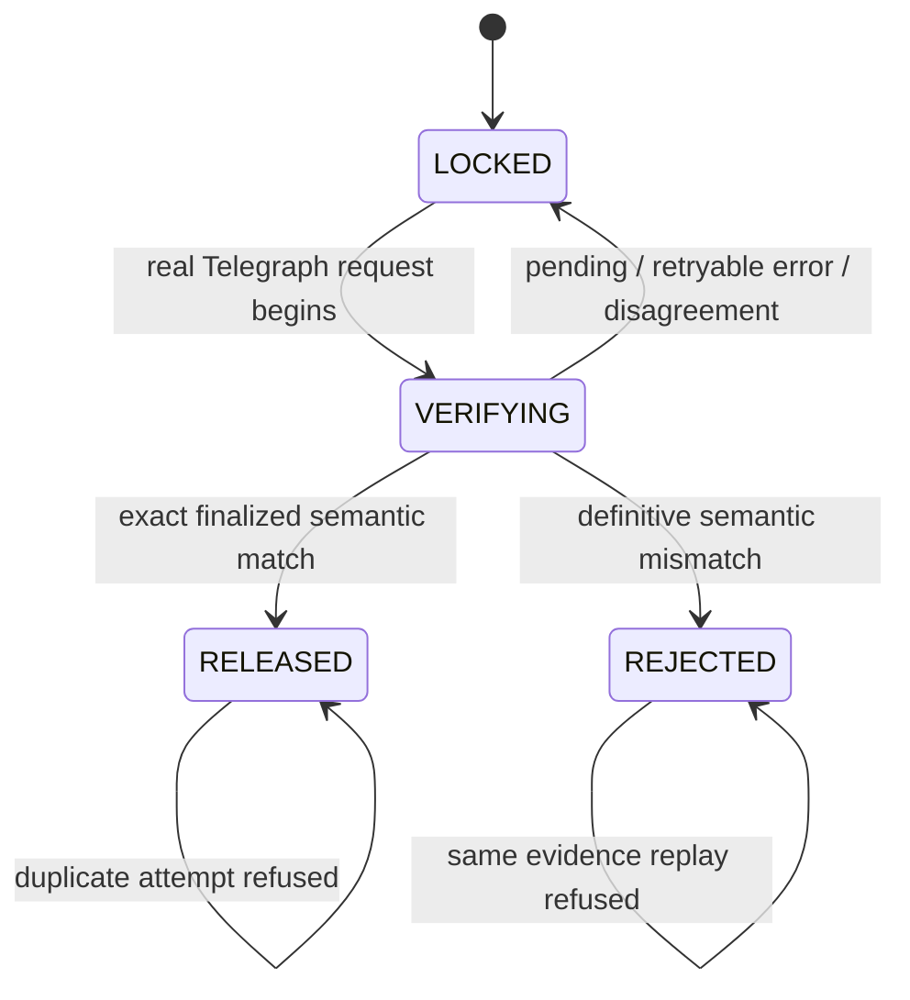
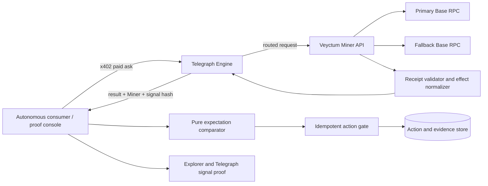

# Veyctum Project Plan

## Document Control

- Status: Approved concept; planning complete; implementation not started
- Version: 1.0.0
- Created date: 2026-08-14
- Last updated date: 2026-08-14
- Planning mode: Deep hackathon functional vertical-slice planning
- Research depth: Deep for sponsor/runtime constraints; standard for implementation stack
- Planning confidence: 82/100 (Medium)
- Intended audience: Solo builder or future execution agent implementing and submitting Veyctum
- Source request summary: Plan the approved Telegraph Hackathon project Veyctum, preserve its win strategy, create an implementation-ready vertical-slice plan, and do not implement it in this planning pass.
- Repository state at planning: Empty Git repository; no implementation, deployment, benchmark, UI, Miner registration, or submission evidence exists.
- Hackathon: Telegraph Season I, Hackathon 1
- Track: Track 1 Miner, with a thin Track 3 consumer used to demonstrate and generate legitimate demand
- Track 1 window: 2026-08-17 through 2026-08-31
- Track 3 window: 2026-08-31 through 2026-09-07

## Executive Summary

Veyctum is a narrowly scoped `ONCHAIN_TX_LOOKUP` Miner for Base ERC-20 transactions. It reports the actual observed token-transfer effects of a referenced transaction instead of treating `receipt.status == 1` as proof that the payment an autonomous consumer expected actually occurred.

The approved winning distinction is:

> Transaction succeeded. Payment did not.

The winning invariant is:

> No expected state change, no success.

The project is technically plausible but carries one release-blocking uncertainty: the official Telegraph canonical question, ground truth, and scoring behavior for `ONCHAIN_TX_LOOKUP` have not yet been shown to reward ERC-20 semantic-effect fields. Richer local decoding has no competitive value if the canonical scorer ignores it. Phase 1 therefore performs a real Telegraph compatibility and scoreability spike before substantial product work.

If the canonical question includes an expected effect and the ground truth scores the resulting semantic verdict, Veyctum may enforce the complete invariant inside the Miner response. If the question supplies only a transaction reference but the ground truth scores normalized ERC-20 effects, the Miner must return observed facts and a thin Track 3 consumer must compare those facts with its expected payment. If token effects are not scoreable, the approved Miner thesis is a no-go and requires a plan amendment rather than silent scope substitution.

The implementation sequence is organized as functional vertical slices:

1. Prove the differentiator is accepted and scoreable in Telegraph.
2. Complete one real paid Telegraph request from a consumer to Veyctum and preserve the signal proof.
3. Complete a valid Base USDC payment verification and action release.
4. Complete the strongest negative flow: a successful transaction whose expected payment effect did not occur, with the action safely blocked.
5. Harden the same loop against the adversarial cases that could invalidate the claim.
6. Register, observe, benchmark, document, and keep the Miner live through Track 3.
7. Capture at least 120 candidate unique Track 3 requests and retain at least 100 that pass the published validity audit so the Intent clears the official eligibility guardrail with margin.

No production code is claimed or included in this plan.

## Project Classification

- Primary category: Web3 infrastructure and API-based developer tool
- Secondary categories: Autonomous-agent safety, blockchain intelligence, hackathon Miner, open-source project
- Intended outcome: A real Telegraph-routed consumer can determine whether a supported Base ERC-20 transaction produced the expected transfer effect and can safely allow or block a downstream action.
- Primary delivery surface: Machine-to-machine HTTP API exposed as a Telegraph Miner
- Secondary delivery surface: Thin web proof console and consumer gate for judges and Track 3 usage
- Estimated complexity: Medium-high within the 15-day Track 1 window
- Estimated risk: High because the differentiator depends on unreleased or unverified canonical scoring behavior
- Software architecture: Required
- UX planning: Required for the proof console, but subordinate to the API workflow
- Security and privacy: Required because verdicts may gate irreversible downstream actions
- Compliance: No regulated data is planned; no compliance claim is made
- External research: Required and completed for load-bearing Telegraph constraints; some live canonical benchmark details remain unresolved

## Project Definition

### One-sentence concept

Veyctum is a Telegraph `ONCHAIN_TX_LOOKUP` Miner that normalizes the observed Base ERC-20 transfer effects of a transaction so autonomous consumers can distinguish EVM execution success from fulfillment of the expected payment.

### Target problem

An EVM receipt with `status == 1` proves that execution did not revert. It does not prove that the intended payment occurred. A successful approval, a transfer to the wrong recipient, a transfer of the wrong token, or a wrong amount can all be successful at the EVM level while failing the consumer's intended outcome.

### Current workaround

Applications trust a receipt status, an explorer summary, a transaction hash supplied by another party, or application-specific log parsing. When ambiguity appears, a human opens an explorer and manually inspects the method, logs, token address, sender, recipient, and amount.

### Proposed mechanism

For a supported Base transaction, Veyctum obtains a finalized receipt from independent RPC providers, validates and normalizes transfer effects emitted by an allowlisted ERC-20 contract, and returns versioned structured facts with inspectable evidence. A separate pure comparator evaluates those facts against an expected transfer unless the official Telegraph question contract explicitly includes the expectation and rewards an in-Miner verdict.

## Problem Statement

Autonomous consumers currently have no standard Telegraph-native way to prove that a successful Base transaction produced the exact ERC-20 transfer they expected. Receipt status, explorer summaries, and transaction hashes can all describe successful execution while concealing an approval-only transaction, wrong token, wrong semantic sender, wrong recipient, or wrong amount. The required outcome is a deterministic, scored, sponsor-routed result that exposes the actual supported transfer effects and allows a downstream system to keep its protected action locked whenever the expected effect is absent or uncertain.

## Target Users or Audience

| Actor | Need | Product relationship |
|---|---|---|
| Autonomous application or agent operator | Decide whether a protected action may proceed after a referenced payment | Primary actor and consumer |
| Agent/application developer | Integrate a stable machine-readable lookup and proof flow | Primary implementer/integrator |
| Merchant or receiving system | Avoid releasing value for an approval, wrong token, wrong recipient, or wrong amount | Secondary beneficiary |
| Telegraph validator/router ecosystem | Receive accurate, deterministic `ONCHAIN_TX_LOOKUP` answers that improve ranking and routing | Sponsor-side participant |
| Track 3 application builder | Consume a real live Miner and create legitimate demand | Adoption partner |
| Hackathon judge | Verify sponsor necessity, technical depth, positive proof, negative enforcement, performance, and demand | Evaluation audience |

## Locked Winning Core

**Problem:** A successful EVM receipt does not prove that the ERC-20 transfer an autonomous consumer expected actually happened.

**Primary actor:** An autonomous application or agent operator that must decide whether to release a downstream action after receiving a transaction reference.

**Secondary actors:** Telegraph validators and routers, Miner operators, merchants or systems receiving payment, judges, and developers integrating the result.

**Job to be done:** Submit a Base transaction reference, receive trustworthy normalized transfer effects through Telegraph, compare them with a frozen expected payment, and release or block the downstream action with inspectable proof.

**Natural interaction surface:** A paid Telegraph Engine request to the Miner API. The proof console is a secondary visual client of the same real flow, not a separate mocked product.

**Winning mechanism:** Treat execution success and semantic success as different facts. Normalize the token, asset sender, recipient, raw amount, transaction status, finality, and evidence rather than returning a generic `SUCCESS` label.

**Sponsor dependency:** Telegraph's canonical Intent classification, YAML Miner registration, x402-paid Engine routing, signal hash, validation, leaderboard scoring, and probabilistic demand routing. The primary demo must use a real Telegraph request and response. A direct call to Veyctum is diagnostic only and cannot prove sponsor integration.

**Winning invariant:** No expected state change, no success.

**Positive proof:** A real, finalized Base USDC transfer is requested through Telegraph; Veyctum returns the matching normalized effect and signal hash; the consumer's frozen expectation matches; the action transitions once from locked to released; the public transaction, signal, and action record are inspectable.

**Negative proof:** A real Base transaction has a successful receipt but contains only an approval or a wrong transfer effect; Veyctum returns the observed non-matching facts; the consumer transitions to rejected and the protected action remains locked; the public transaction and Telegraph signal prove the rejection was intentional rather than a crash.

**Judge demo path:** Show two public Base transactions marked successful. Send each through the real Telegraph Engine. The correct USDC transfer produces a matching effect and releases one demo action. The approval or wrong-recipient transaction produces no matching expected effect and leaves the second action locked. Inspect both transaction hashes, both Telegraph signal hashes, raw normalized effects, and the unchanged rejected action state.

**Critical judging criteria:** Official Miner score is 75% normalized performance within the Intent and 25% public X engagement and transparency. Global cash eligibility requires at least three active Miners in the Intent and at least 100 real Track 3 requests. Miners must remain live throughout Track 3, applications may not use mocked Miner data, judged updates must be public and tagged, and metric gaming is disqualifying.

## Core Workflow or Delivery Model

The delivery model is a machine-to-machine paid intelligence request with a thin visual client of the same runtime path. The Miner is stateless for finalized lookup facts; the consumer owns the expectation, durable protected-action state, and idempotent consequence.

## Core Operational Loop

```text
Autonomous consumer
-> freezes expected Base USDC transfer and protected action ID
-> submits a real transaction reference through Telegraph Engine with x402
-> Telegraph classifies/routes the ONCHAIN_TX_LOOKUP request to Veyctum
-> Veyctum validates Base chain, finality, RPC agreement, token identity, logs, sender, recipient, and raw amount
-> Veyctum returns normalized observed effects and evidence
-> Telegraph returns Miner identity, result, duration, signal hash, and settlement metadata
-> consumer compares the observed effect with the frozen expectation
-> exact match changes the action from LOCKED to RELEASED once; mismatch changes it to REJECTED and keeps it locked
-> consumer receives a clear result
-> transaction link, raw effect, signal hash, request ID, and action audit entry remain inspectable
```

If official canonical questions carry expected-effect fields and score the verdict, the comparison may occur inside the Miner adapter. Otherwise the comparison remains in the consumer. The distinction must be explicit in code, UI, README, and demo narration.

## Primary Actor Journey

### Starting state

- The consumer has a protected action that is `LOCKED`.
- The consumer has a frozen expected effect: Base chain ID, allowlisted token contract, semantic sender, recipient, and exact raw amount.
- The consumer has a Base transaction reference supplied by the payer or upstream workflow.
- The consumer has a configured x402 signer funded with Base Sepolia USDC for Telegraph requests.

### Successful journey

1. The consumer creates a verification request with a unique action ID and expected effect.
2. Input validation rejects invalid hashes, unsupported chain/token combinations, invalid addresses, non-positive amounts, floats, and unknown fields.
3. The consumer pays and sends the lookup through Telegraph's Engine rather than calling Veyctum directly.
4. Telegraph returns the selected Miner identity and a result with a signal hash.
5. Veyctum's result identifies a finalized successful transaction and the normalized matching ERC-20 transfer.
6. The comparator evaluates contract address, log sender, recipient, and raw amount using exact equality.
7. The protected action atomically transitions from `LOCKED` to `RELEASED`.
8. Replaying the same verification cannot release it again.
9. The consumer receives a result that links the public transaction, Telegraph signal, raw evidence, and action transition.
10. Expected time to visible value for a finalized fixture is less than 15 seconds under normal provider conditions, excluding x402 wallet confirmation setup.

### Negative journey

1. The consumer creates the same kind of verification request for a successful approval, wrong-recipient transfer, wrong-token transfer, or wrong amount.
2. Telegraph routes the real request and Veyctum returns observed facts.
3. The comparator finds no exact expected transfer effect.
4. The action transitions from `LOCKED` to `REJECTED`; no release side effect occurs.
5. The consumer sees the precise mismatch and supporting proof.
6. Retry is allowed only with a different transaction reference or a newly authorized action; rejected evidence cannot be silently converted to success.

### Recovery journey

- `PENDING`: wait for finality, then retry without changing the expectation.
- `RPC_DISAGREEMENT`: retry after provider recovery; never release while providers disagree.
- `NOT_FOUND`: correct the transaction reference.
- `UNSUPPORTED`: choose a supported canonical token or use another verifier; do not downgrade the result to a generic failure or success.
- Telegraph/x402 failure: preserve `LOCKED`, show a retryable sponsor error, and do not fall back to a direct Miner response for the protected action.

## Product Principles and Anti-Goals

### Principles

1. Observed facts before business claims.
2. Exact token contract and integer amount matching.
3. Fail closed on uncertainty.
4. Real Telegraph routing in every winning proof.
5. Public, replayable evidence for every central claim.
6. One complete Base USDC workflow before breadth.
7. Honest separation between Track 1 Miner behavior and Track 3 consumer enforcement.

### Anti-goals

- Universal transaction decoding
- Multichain support
- Bridges, swaps, NFTs, arbitrary DeFi, native ETH, or contract-state interpretation
- Arbitrary or untrusted ERC-20 contracts
- Fee-on-transfer, rebasing, reflection, or otherwise nonstandard tokens
- AI/LLM-based decoding
- A portfolio dashboard, wallet product, payment processor, custody system, or settlement contract
- A custom scoring module unless official evidence shows it is necessary and feasible under a separately approved amendment
- Claims of trustlessness, production readiness, or universal correctness

## Scope

### Core scope (P0)

- Validate the live `ONCHAIN_TX_LOOKUP` canonical request, response, and scoreability assumptions.
- Implement a deterministic Base transaction-effect Miner API.
- Support one canonical USDC contract per selected Base environment, confirmed against official Circle documentation.
- Obtain receipts and validate agreement from a primary and independent fallback RPC.
- Require configured finality before a definitive result.
- Strictly decode and normalize canonical ERC-20 `Transfer` logs.
- Return versioned structured observed facts with explicit error states.
- Register a public Telegraph Miner via a valid public YAML.
- Complete x402-paid direct and auto-routed Telegraph requests.
- Preserve Miner ID, intent, duration, cost, timestamp, signal hash, raw result, and settlement evidence.
- Implement a thin consumer proof gate with durable idempotent action state.
- Demonstrate one positive and one strongest negative flow using real Telegraph results.
- Build a public adversarial benchmark and compare against a receipt-only baseline.
- Add monitoring and keep the Miner operational throughout Track 3.
- Publish evidence-led X updates and legitimate request-count evidence.

### Supporting scope (P1)

- A responsive proof console that consumes the same API flow.
- Verification history with source labels and evidence links.
- Clear empty, validating, paying, routing, decoding, comparing, pass, reject, pending, unsupported, disagreement, and retry states.
- One-command fresh-clone setup, fixture replay, benchmark, and audit commands.
- Structured logs, health/readiness checks, request correlation, redaction, and operational runbook.
- Public evidence index and submission-oriented README.

### Judge amplification (P2)

- Side-by-side receipt success versus semantic outcome rail.
- Raw JSON evidence drawer.
- Benchmark comparison chart generated from committed raw results.
- Three-minute uncut demo and final evidence thread.
- Guardrail evidence for active Miner count and legitimate Track 3 requests.

### Future scope

- Additional canonical ERC-20 tokens after each receives its own compatibility evidence.
- Native-asset effects if the official benchmark requires them.
- SDK package for consumer integrations.
- On-chain callback or ERC-8183 consumer after the off-chain flow is proven.
- Additional EVM chains only through an approved architecture and threat-model amendment.

### Explicit exclusions

- No multichain claim in H1.
- No arbitrary token support.
- No floats, token-symbol equality, or amount tolerances in the core comparator.
- No generic `status: success` verdict.
- No fake or local-only sponsor response in the judge path.
- No application metric counted without a request-validity and deduplication rule.
- No public claim unsupported by a transaction, test, Telegraph artifact, or immutable result file.

## Feasibility and Scope Gate

Scores use 1 (poor) to 5 (strong).

| Dimension | Score | Evidence | Uncertainty / proof required | Consequence if wrong |
|---|---:|---|---|---|
| Problem clarity | 5 | Receipt success and payment effect are objectively distinct | None material | No scope change |
| User clarity | 4 | Autonomous consumers need a post-transaction gate | Validate at least one real Track 3 integration | Thin proof console may be the only consumer |
| Technical feasibility | 4 | Receipts and ERC-20 logs are deterministic and accessible | Confirm official schema and benchmark semantics | Pivot or plan amendment if unscoreable |
| Operational feasibility | 4 | One API, two RPCs, one token, and one consumer are manageable | Hosted endpoint and x402 operations must be stable | Eligibility and demo fail if uptime is poor |
| Schedule feasibility | 4 | Narrow scope fits 15 days if the go/no-go test occurs first | No time for broad token or chain support | Cut P2/P3 before weakening P0 |
| Budget feasibility | 4 | Main costs are hosting, RPC, gas, and paid x402 calls | User budget is unspecified | Use free/low-cost tiers and explicit spend alerts |
| Security feasibility | 4 | Allowlisting and fail-closed rules constrain attacks | RPC trust and malicious token semantics remain | Unsupported cases must abstain |
| Regulatory feasibility | 5 | No custody, financial advice, personal data, or irreversible payment execution is planned | Consumer demo action must remain nonfinancial | Legal scope changes if real goods/funds are released |
| Dependency feasibility | 3 | Telegraph docs and live APIs are available | Canonical scorer, routing, x402 funding, and competitor state are external | Release blocked if the differentiator is ignored |
| Adoption feasibility | 3 | Guardrail is only 100 real requests, but Track 3 is seven days | Real users/apps and request validity must be secured | Global cash eligibility fails |

**Verdict:** Proceed with prerequisite validation and strict scope protection.

Do not proceed beyond the Phase 1 exit gate if the canonical benchmark cannot reward normalized ERC-20 effects. Do not disguise a no-go outcome by moving the local comparator into the Miner and calling it official performance.

## Success Criteria

### Hackathon success

| ID | Criterion | Target | Evidence |
|---|---|---|---|
| SC-001 | Canonical compatibility | Real Telegraph request accepts Veyctum's supported schema and returns a signal hash | Captured request/response and signal lookup |
| SC-002 | Competitive performance | Highest normalized score in `ONCHAIN_TX_LOOKUP`, or documented score at least 0.95 of the current best before deadline | Official leaderboard/API evidence and timestamp |
| SC-003 | Intent guardrail | At least 3 active Miners in `ONCHAIN_TX_LOOKUP` | Live Intent API export |
| SC-004 | Demand guardrail | At least 120 candidate unique Track 3 requests captured, with at least 100 passing the published validity rules and manual audit | Request ledger, audit command, checksum, and Telegraph evidence |
| SC-005 | Availability | Miner remains reachable and operational throughout Track 3 with measured uptime at least 99% excluding confirmed Telegraph-wide incidents | External probes and incident log |
| SC-006 | Public transparency | Evidence-led public updates are consistently posted and correctly tag `@Telegraphprotoc` | Public X thread index |

### Product success

| ID | Criterion | Target | Evidence |
|---|---|---|---|
| SC-007 | Positive flow | A valid finalized Base USDC transfer releases exactly one protected demo action | E2E test, transaction, signal, and action audit entry |
| SC-008 | Negative enforcement | A successful approval or non-matching transfer never releases the protected action | E2E test and unchanged action state |
| SC-009 | Replay safety | Replaying an accepted verification cannot release the same action twice | Integration test and uniqueness constraint evidence |
| SC-010 | Adversarial coverage | All P0 attack cases have deterministic tests and documented outcomes | Test matrix and raw results |
| SC-011 | Reproducibility | A fresh clone can configure, run fixtures, start the service, and replay the core flow from documented commands | Clean-environment transcript |
| SC-012 | Demo clarity | The real positive and negative flow fits in an uncut video under 180 seconds | Final video and storyboard check |

## Requirements

### Functional requirements

| ID | Requirement |
|---|---|
| FR-001 | The system shall validate whether the released canonical `ONCHAIN_TX_LOOKUP` question and ground truth can represent and score ERC-20 effects before full implementation proceeds. |
| FR-002 | The Miner shall accept only the request shape allowed by the registered Telegraph endpoint and shall reject unknown fields at its external boundary. |
| FR-003 | A transaction reference shall be a valid 32-byte EVM hash; malformed input shall fail before any RPC call. |
| FR-004 | The Miner shall bind every lookup to a configured Base chain ID rather than accepting caller-selected arbitrary chains. |
| FR-005 | The Miner shall query a primary and independent fallback RPC and compare chain ID, transaction hash, receipt status, block number, block hash, and relevant logs before issuing a definitive result. |
| FR-006 | The Miner shall return `PENDING` until the configured confirmation/finality threshold is met. |
| FR-007 | The Miner shall identify supported tokens by allowlisted contract address, never by symbol or name. |
| FR-008 | The Miner shall strictly decode ERC-20 `Transfer(address,address,uint256)` logs emitted by a supported token contract and preserve block hash, transaction hash, and log index as evidence. |
| FR-009 | The Miner shall return normalized effects containing schema version, chain ID, transaction hash, execution status, finality, token contract, semantic sender, recipient, raw amount, and evidence references. |
| FR-010 | The Miner shall return explicit states for `NOT_FOUND`, `REVERTED`, `PENDING`, `NO_SUPPORTED_TRANSFER`, `AMBIGUOUS`, `RPC_DISAGREEMENT`, `UNSUPPORTED`, `INVALID_INPUT`, and `UPSTREAM_ERROR`. |
| FR-011 | The comparator shall accept a frozen expected token address, sender, recipient, and positive raw integer amount, and compare them with normalized observed effects using exact equality. |
| FR-012 | The comparator shall derive the semantic sender from the token log, not assume `tx.from` is the asset sender. |
| FR-013 | The comparator shall reject zero-value transfers, self-transfers, mint, burn, wrong token, wrong sender, wrong recipient, wrong amount, approval-only transactions, ambiguous candidates, and unsupported behavior. |
| FR-014 | Matching split transfers to the same token/sender/recipient may be aggregated with checked arbitrary-precision arithmetic while preserving individual log evidence and preventing duplicate log counting. |
| FR-015 | The consumer shall create a unique protected action in `LOCKED` state before verification and freeze the expected effect for that action. |
| FR-016 | A matching finalized result obtained through a real Telegraph request shall atomically transition a protected action from `LOCKED` to `RELEASED` once. |
| FR-017 | A definitive semantic mismatch shall transition the action from `LOCKED` to `REJECTED` without executing its protected side effect. |
| FR-018 | Pending, unsupported, disagreement, invalid, upstream, Telegraph, and payment errors shall preserve `LOCKED` and expose a clear retry or remediation path. |
| FR-019 | The consumer shall reject duplicate release attempts for the same action ID and retain an audit entry for every verification attempt. |
| FR-020 | The production proof console shall obtain Miner results through Telegraph Engine; direct Miner calls may appear only in clearly labeled diagnostics. |
| FR-021 | The Telegraph client shall preserve Miner ID/name, intent, endpoint, result, cost, duration, timestamp, signal hash, warnings, and payment settlement evidence when available. |
| FR-022 | The proof console shall link to the transaction explorer and `GET /engine/v1/signal/{signal_hash}` evidence where available. |
| FR-023 | The repository shall include real positive and negative public transaction fixtures plus deterministic local fixtures for attacks that cannot safely be reproduced live. |
| FR-024 | The benchmark shall run Veyctum and a receipt-only baseline over the same labeled corpus and emit machine-readable raw results. |
| FR-025 | The Miner shall expose health and readiness endpoints that verify process health and load-bearing RPC/configuration readiness separately. |
| FR-026 | The Miner shall be described by valid public Telegraph YAML with accurate endpoint, schema, auth, supported Intent, limits, documentation, and repository metadata. |
| FR-027 | Registration evidence shall include the YAML hash, hosted YAML URL, Base Sepolia registration transaction, registration ID, active state, and live discovery entry. |
| FR-028 | Track 3 request accounting shall record a non-secret request identifier, timestamp, Telegraph signal hash, consumer identifier class, outcome, and deduplication key without storing private keys or payment signatures. |
| FR-029 | The request-audit command shall deterministically reproduce the valid unique request count from the published ledger. |
| FR-030 | All central demo states shall be derived from real sources and label fixture-derived supplemental states as fixtures. |

### Non-functional requirements

| ID | Requirement |
|---|---|
| NFR-001 | The semantic core shall be deterministic and shall not call an LLM. |
| NFR-002 | The codebase shall target Node.js 24 LTS and pin exact dependency versions at the first implementation checkpoint; current versions recorded on 2026-08-14 are research inputs, not automatic lock choices. |
| NFR-003 | A valid finalized fixture lookup should complete within 5 seconds at p95 for a direct Miner call and within 15 seconds at p95 for a paid Telegraph flow under normal provider conditions; measurements shall exclude human wallet-funding setup. |
| NFR-004 | The Miner shall remain available at least 99% during Track 3, excluding independently confirmed Telegraph-wide or Base-wide incidents. |
| NFR-005 | The API shall enforce body size, field count, hash length, log-count, response-size, request-timeout, and rate limits documented in YAML and code. |
| NFR-006 | Logs shall be structured and correlated while redacting private keys, API keys, payment signatures, raw authorization headers, and wallet secrets. |
| NFR-007 | Finalized immutable lookup results may be cached only by `(chain_id, transaction_hash, schema_version)`; pending or disagreement results shall not be cached as final. |
| NFR-008 | A clean clone shall pass formatting, type checking, unit tests, integration tests, contract tests, fixture replay, and benchmark commands without undocumented state. |
| NFR-009 | Public UI text shall meet WCAG 2.2 AA contrast; all core controls shall be keyboard operable; status shall not rely on color alone. |
| NFR-010 | The proof console shall be usable at 360 px width and on a standard desktop viewport without hiding evidence fields. |
| NFR-011 | The project shall have a rollback procedure to the last known healthy deployment and shall preserve published evidence even if the live deployment rolls back. |
| NFR-012 | No telemetry event shall contain private keys, payment signatures, full authorization headers, or unnecessary personal information. |

### Business rules

| ID | Rule |
|---|---|
| BR-001 | Execution success is necessary but never sufficient for semantic success. |
| BR-002 | The H1 payment invariant uses exact raw integer amount equality; overpayment and underpayment are mismatches. |
| BR-003 | Token identity is the contract address on the fixed chain, never ticker metadata. |
| BR-004 | The semantic asset sender is the `from` indexed in a valid token `Transfer` log. |
| BR-005 | Zero amount, self-transfer, mint, and burn cannot satisfy the payment invariant. |
| BR-006 | An unsupported token or uncertain result produces abstention, never an inferred success. |
| BR-007 | Only a real Telegraph result may release the protected Track 3 demo action. |
| BR-008 | A protected action may be released at most once. |
| BR-009 | Metric validity shall be defined before collection; synthetic probes, duplicate retries, builder-controlled loops, and failed requests do not count as real Track 3 demand. |
| BR-010 | Local benchmark results and official Telegraph scores must be labeled separately. |

## State Model

### Protected action state



Invalid transitions:

- `LOCKED -> RELEASED` without a persisted real Telegraph signal and matching comparator result
- `REJECTED -> RELEASED` without creating a new authorized action
- `RELEASED -> LOCKED` through normal application behavior
- Any second protected side effect after `RELEASED`

### Verification attempt state

```text
CREATED
-> VALIDATING
-> PAYMENT_REQUIRED
-> PAYING
-> ROUTING
-> MINER_PROCESSING
-> RESULT_RECEIVED
-> COMPARING
-> MATCHED | MISMATCHED | PENDING | UNSUPPORTED | DISAGREEMENT | FAILED
```

For every transition, the source of truth is the server-side verification record. The UI reflects that record and must not infer completion from client-local state.

## Real Data and State Sources

| Dynamic state | Classification | Source of truth | Notes |
|---|---|---|---|
| Transaction receipt and logs | ONCHAIN via external RPC | Base canonical chain as reported consistently by configured providers | Explorer is evidence UI, not the computation source |
| USDC contract identity | STATIC CONFIG backed by official source | Circle contract-address documentation plus chain ID | Revalidated before registration |
| Miner discovery and Intent count | SPONSOR API | Telegraph live `/engine/v1/intents` and `/api/miners` | Snapshot dates must be shown |
| Paid routed result | SPONSOR API | Telegraph Engine response | Must retain Miner identity and signal hash |
| Signal evidence | SPONSOR API / protocol record | Telegraph `GET /engine/v1/signal/{hash}` | Used for public proof |
| Expected effect | ACTOR INPUT, frozen server-side | Protected action record | Immutable after verification begins |
| Semantic match | DERIVED | Pure comparator output over expected and observed facts | Versioned comparator policy |
| Action status | DATABASE | Local application database | Atomic and idempotent transition |
| Verification history | DATABASE | Local append-only audit records | No secrets or payment signatures |
| Benchmark corpus | REPOSITORY | Versioned fixture files and public hashes | Ground-truth creation documented |
| Official score | SPONSOR API / leaderboard | Telegraph official output | Never substituted by local score |
| Request guardrail count | DERIVED from DATABASE + SPONSOR evidence | Published deduplicated ledger and audit command | Validity rules fixed before Track 3 |
| Marketing copy and diagrams | STATIC CONTENT | Repository | Must not claim dynamic state |

## Architecture

### Recommended architecture

A TypeScript modular monolith with separately deployable Miner API and proof-console application, sharing versioned schemas and the pure effect/comparator packages. Use a small relational store for protected-action idempotency and request evidence. Do not introduce queues, microservices, an event bus, or custom smart contracts for H1.



### Component responsibilities

| Component | Responsibility | Inputs / outputs | Owned data | Trust boundary and failure behavior | Scaling concern / justification |
|---|---|---|---|---|---|
| Telegraph adapter | Expose the exact registered endpoint and translate between canonical request and internal lookup | Telegraph payload -> internal hash; normalized result -> registered output | None | Treat every input as untrusted; reject schema drift | Thin adapter isolates canonical changes |
| RPC gateway | Query two providers and compare critical receipt data | Chain-bound hash -> agreed receipt or explicit disagreement | Finalized cache only | RPC providers are untrusted external dependencies; fail closed | Parallel calls reduce latency; no quorum beyond two for H1 |
| Effect normalizer | Strictly validate supported token logs and build deterministic effects | Agreed receipt -> versioned effects | None | Malformed and excessive logs are untrusted | Pure code is easy to test and benchmark |
| Comparator | Compare expected and observed effects | Frozen expectation + effects -> match/mismatch/reason | None | No external calls or mutable state | Pure and portable; boundary depends on canonical schema |
| Telegraph client | Discover/pay/route through the real Engine and retain proof metadata | Consumer query + signer -> paid result and signal | Settlement metadata excluding secrets | Telegraph and facilitator can fail; preserve locked state | One client library, bounded retries |
| Action gate | Enforce `LOCKED -> RELEASED/REJECTED` atomically and once | Comparator result + evidence -> action transition | Protected actions and attempts | Security boundary for duplicate effects | SQLite is sufficient for hackathon demand |
| Proof console | Natural visual inspector for judges and operators | Actor inputs -> server workflow -> evidence rail | No authoritative client-only state | Never renders local fixture data as live | One page, no dashboard/navigation sprawl |
| Benchmark runner | Compare Veyctum and receipt-only baseline over labeled cases | Corpus -> raw metrics and failures | Versioned result artifacts | Local score is not official score | Offline command; no runtime scaling need |
| Evidence exporter | Produce request ledger, hashes, score snapshots, and audit output | Database and sponsor exports -> public artifacts | Redacted exports | Must exclude secrets and personal data | Run on demand |

### Technology recommendations

Versions below were checked on 2026-08-14 and must be pinned at implementation time after compatibility validation.

| Technology | Recommendation and role | Rationale | Trade-off / alternative | Reconsideration trigger |
|---|---|---|---|---|
| Node.js | Node.js 24 LTS runtime | Supported by x402 requirement (20+) and current LTS | Node 22 LTS if a dependency is incompatible | Any x402 or hosting incompatibility |
| TypeScript | TypeScript 7.0.2 candidate | Shared strict types across API, consumer, fixtures | Pin latest stable compatible version; do not adopt a breaking release blindly | Ecosystem incompatibility |
| API server | Fastify 5.12.0 | JSON Schema integration, low overhead, clear plugins | Hono or native Node HTTP | Hosting/runtime incompatibility |
| Chain client | viem 2.55.16 | Typed EVM receipt/log access and Base support | ethers | Required function missing or upstream incompatibility |
| Validation | Zod 4.4.3 plus emitted/handwritten JSON Schema at public boundaries | Strict runtime validation and shared types | TypeBox | YAML/Telegraph schema tooling fits TypeBox better |
| Logging | Pino 10.3.1 | Structured redacted logs | Platform logger | Hosting provides equivalent correlated logs |
| Tests | Vitest 4.1.10 | TypeScript unit and integration tests | Node test runner | Tooling incompatibility |
| Web console | React 19.2.8 with Vite 8.2.1 | Small single-page proof surface | Server-rendered HTML | Build complexity exceeds value |
| x402 | `@x402/fetch`, `@x402/core`, `@x402/evm` 2.22.0 | Officially documented client family | Telegraph MCP for manual diagnostics | Package/API mismatch with Telegraph node |
| Database | SQLite using a maintained Node driver or platform equivalent | Atomic idempotency and auditability without infrastructure sprawl | Postgres if deployment forbids durable SQLite | Multiple instances or durability limitations appear |

### Architecture decisions

| ID | Decision | Status | Rationale | Reconsideration trigger |
|---|---|---|---|---|
| ADR-001 | Use a modular TypeScript monolith rather than microservices | Proposed | Small team, short deadline, shared schemas, simpler deploy/test | Independent scaling or deployment becomes proven necessary |
| ADR-002 | Keep observed-effect lookup separate from expected-effect policy | Conditional lock | Canonical question may contain only a transaction reference | Official question and ground truth explicitly score expectations |
| ADR-003 | Fix one Base environment and one official USDC contract per registration | Locked for H1 | Prevents cross-chain and fake-token ambiguity | Canonical benchmark requires another network/token |
| ADR-004 | Use exact raw integer equality | Locked for H1 | Deterministic and judge-auditable | Approved business policy requires tolerance |
| ADR-005 | Require independent RPC agreement and configured finality | Locked | A single provider cannot support the verification claim | Official ground truth requires a different finality definition |
| ADR-006 | Use local durable action state only for the Track 3 proof gate | Proposed | Idempotent consequence makes the invariant operational | Real integration provides a stronger reversible action |
| ADR-007 | Do not deploy a custom smart contract in H1 | Proposed | It adds audit surface without improving Miner score | Telegraph on-chain job becomes mandatory for scoring or submission |

## API and Integration Contracts

### Miner endpoint

- Name: Transaction effect lookup
- Caller: Telegraph Miner dispatcher
- Authentication: Configured in public YAML; prefer a server-held API key injected by Telegraph if the endpoint is not public
- Input: Officially compatible transaction reference schema discovered in Phase 1
- Validation: Exact schema, Base-bound hash, unknown-field rejection, size limits
- Output: Versioned normalized observed facts; exact public shape is frozen only after Phase 1
- Errors: Structured states in FR-010 with appropriate HTTP status for invalid/upstream failures
- Side effects: None
- Idempotency: Same finalized hash and schema version returns equivalent result
- Timeout: Target <= 8 seconds upstream timeout, subject to Telegraph endpoint limits
- Retries: At most one bounded retry per provider for transient transport errors; never retry semantic failures
- Rate limits: Declare and enforce a conservative limit based on RPC quotas
- Versioning: `schema_version` in output; breaking changes require new endpoint/YAML registration strategy
- Compatibility: Must pass Telegraph integration sandbox and live paid request
- Data shared: Public transaction hash and derived public chain data only

### Telegraph Engine integration

- Trigger: Consumer requests verification through auto-routed Engine; direct Engine call is used for deterministic diagnostics
- Input: Natural-language lookup query plus structured context only if the live router and Miner schema support it
- Expected output: Miner metadata, result, cost, duration, timestamp, intent for auto-route, signal hash, and settlement response
- Payment: x402 challenge and Base Sepolia USDC using official x402 libraries; never hardcode `payTo`
- Failure behavior: No consumer release; persist retryable failure without storing payment signature
- Verification: Fetch and re-derive or inspect `GET /engine/v1/signal/{signal_hash}` evidence
- Load-bearing test: Removing this call must make the protected action unable to release in the production proof flow

### RPC integration

- Caller: Miner API
- Authentication: Server-side environment variables
- Input: Fixed chain ID and validated hash
- Output: Transaction and receipt data sufficient for status, block/finality, and logs
- Timeouts: Per-provider timeout with total request budget
- Retry: Bounded transient retry only
- Failure behavior: One provider unavailable may be retryable; conflicting critical facts produce `RPC_DISAGREEMENT`
- Data shared: Public hash only
- Provider selection decision: `DEC-003`

### Action-gate API

- Caller: Proof console or Track 3 consumer
- Authentication: Omitted for a single public demo only if action state is nonfinancial and unprivileged; otherwise require signed/session-bound ownership
- Input: Unique action ID, frozen expectation, transaction reference
- Output: Current action state, verification state, mismatch reason, and evidence references
- Side effects: Atomic release or rejection of a nonfinancial demo action
- Idempotency: Unique action ID and consumed transition constraint
- Concurrency: Transactional compare-and-set from `LOCKED`
- Failure behavior: Any uncertainty preserves `LOCKED`

## Data Model

### `protected_action`

- Purpose: Represent the downstream consequence protected by Veyctum.
- Fields: `id`, `created_at`, `status`, fixed `chain_id`, `token_address`, `expected_sender`, `expected_recipient`, `expected_amount_raw`, optional non-sensitive label, `released_at`, `rejected_at`, `version`.
- Ownership: Demo consumer application.
- Uniqueness: `id` unique.
- Validation: Canonical addresses, supported token, positive integer amount.
- Lifecycle: `LOCKED -> VERIFYING -> RELEASED | REJECTED`, with retry returning `VERIFYING -> LOCKED`.
- Deletion: Retain through submission and judging; afterward document retention and purge procedure.
- Sensitivity: Low; do not attach names or private payment context.

### `verification_attempt`

- Purpose: Append-only evidence and failure record.
- Fields: `id`, `action_id`, `created_at`, `tx_hash`, `state`, `miner_id`, `miner_name`, `intent`, `signal_hash`, `duration_ms`, `cost_usd`, `schema_version`, `observed_effect_digest`, `comparison_result`, `reason_code`, `error_class`, `dedup_key`.
- Relationships: Many attempts to one protected action.
- Uniqueness: `id`; deduplication key indexed.
- Retention: Through results and judging; publish redacted subset.
- Sensitive fields forbidden: Private keys, x402 payment signatures, auth headers, RPC keys.

### `observed_effect`

- Purpose: Persist or export normalized public facts.
- Fields: `chain_id`, `tx_hash`, `block_number`, `block_hash`, `receipt_status`, `finality`, `token_address`, `from`, `to`, `amount_raw`, `log_index`, `schema_version`.
- Source of truth: Veyctum result and public chain evidence.
- Uniqueness: `(chain_id, block_hash, tx_hash, log_index, schema_version)`.
- Deletion: Immutable evidence may be retained; no personal metadata is added.

### `request_evidence`

- Purpose: Audit legitimate Track 3 demand.
- Fields: Redacted request ID, timestamp, signal hash, outcome, consumer class, dedup key, valid/invalid flag, invalid reason.
- Validity: Defined before Track 3; one real application-originated paid request for an actual verification need, not a health probe or artificial loop.
- Export: Deterministic JSONL/CSV plus SHA-256 checksum and audit summary.

## Security and Threat Model

### Protected assets

- Correctness of semantic-effect results
- Integrity and single execution of protected actions
- x402 signing key and funded wallet
- RPC and endpoint credentials
- Telegraph registration wallet and fee address
- Public score and request-evidence credibility

### Trust boundaries

- Untrusted consumer input entering the application and Miner
- Telegraph node and payment facilitator as external sponsor dependencies
- Independent RPC providers as external sources
- Public chain logs, which may be emitted by malicious arbitrary contracts
- Browser/client state versus server-authoritative action state
- Public evidence export versus private operational secrets

### Material threats

| ID | Threat / attack path | Likelihood | Impact | Prevention | Detection / recovery | Verification |
|---|---|---:|---:|---|---|---|
| TH-001 | Approval-only transaction is presented as payment | High | High | Accept supported Transfer effects only | Mismatch reason; action stays locked | Public negative fixture and E2E test |
| TH-002 | Fake token uses the same symbol as USDC | High | High | Fixed chain and allowlisted contract address | Unsupported/wrong-token reason | Spoof-token fixture |
| TH-003 | Wrong sender, recipient, or amount passes loose comparison | Medium | High | Exact address and bigint equality | Comparator audit fields | Unit and E2E matrix |
| TH-004 | Zero/self/mint/burn transfer masquerades as payment | Medium | High | BR-005 rejection | Explicit reason codes | Deterministic fixtures |
| TH-005 | Duplicate log or request causes double count/release | Medium | High | Log identity dedup and atomic action constraint | Duplicate attempt audit | Concurrency and replay tests |
| TH-006 | Reorged pending receipt becomes permanent success | Low-medium | High | Finality threshold and final-only cache | Recheck block hash; invalidate pending | Reorg simulation |
| TH-007 | RPC lies or serves stale/conflicting data | Medium | High | Independent provider comparison | `RPC_DISAGREEMENT`; alert | Conflicting-provider integration test |
| TH-008 | Oversized/malformed receipt exhausts resources | Medium | Medium | Strict log/size/time bounds | Rate-limit and error metrics | Security/fuzz tests |
| TH-009 | Client forges a pass state or bypasses gate | Medium | High | Server-side comparison and atomic state | Audit mismatch | API authorization and E2E test |
| TH-010 | x402 or Telegraph failure triggers direct-call fallback | Medium | High | BR-007; sponsor errors preserve locked state | Alert on prohibited path | Failure injection test |
| TH-011 | Secrets leak through logs/evidence | Medium | High | Redaction and forbidden-field tests | Secret scanning and incident key rotation | CI scans and log tests |
| TH-012 | Artificial request loops inflate eligibility | Medium | Disqualification | Predefined validity, deduplication, public audit | Flag duplicate/controlled sources | Audit command and manual sampling |
| TH-013 | Dependency or image supply-chain compromise | Low-medium | High | Lockfile, minimal packages, provenance/SBOM where practical | Dependabot/audit and rollback | CI scan |
| TH-014 | Canonical schema changes after registration | Medium | High | Monitor discovery and score; version adapters | Health/score alert; re-register only after validation | Contract test against live API |

Residual risk: A supported token contract and Base/RPC infrastructure remain trusted dependencies. Veyctum does not prove arbitrary contract balance deltas or eliminate protocol governance, provider, or canonical-ground-truth risk. These limitations must be stated publicly.

## Performance, Reliability, and Operations

- Health endpoint: Process alive; no external dependency required.
- Readiness endpoint: Configuration valid, supported token configured, and at least one RPC responding with expected chain ID; registration state may be reported separately.
- Synthetic checks: Direct non-paid health checks plus scheduled real paid Telegraph checks at a conservative cadence; synthetic checks never count toward Track 3 demand.
- Metrics: Request count by result state, RPC latency/error/disagreement, Telegraph latency/error, comparator outcomes, action transitions, cache hit rate, and readiness.
- Alerts: Readiness failure for 2 minutes, error rate above 5% over 5 minutes, any RPC disagreement spike, no successful synthetic routed call for 15 minutes, or unexpected score/registration status change.
- Logs: Structured request correlation with secrets redacted.
- Recovery time objective: Restore the last known healthy deployment within 30 minutes during Track 3.
- Recovery point: No accepted action transition may be lost; SQLite/database snapshot or platform persistence must support this. If the deployment cannot guarantee durable local storage, use managed Postgres under an approved implementation detail.
- Rollback: Immutable image/release tag and documented one-command redeploy.
- Incident rule: Any uncertainty stops release actions and is documented in `PROJECT_STATE.md` and the public incident record when it affects judging evidence.

## Cost and Critical Dependencies

Budget is unresolved. The executor shall establish a spending cap before using paid infrastructure.

| Dependency / cost | Basis | Expected H1 usage | Control | Failure fallback |
|---|---|---|---|---|
| Telegraph x402 calls | Per-call USDC, dynamic from challenge | Benchmark diagnostics plus >=120 candidate unique Track 3 calls, with >=100 audited-valid | Never hardcode price/payee; log cost; daily spend alert | Preserve locked state; retry later |
| Base Sepolia registration gas | Registration transaction | One planned registration plus contingency | Validate YAML before sending | Correct and re-register only if necessary |
| RPC providers | Request quota or paid tier | Two providers for every definitive lookup | Rate limit, cache finalized results, quota alerts | Fail closed if independent agreement unavailable |
| API/UI hosting | Instance/bandwidth | Continuous through judging | Use simple deploy and spending alert | Secondary provider or last healthy image |
| Database | Durable small relational store | Low volume | Minimal retention and backups | Managed database if local disk is not durable |
| Domain | Optional | Not required for correctness | Use deployment URL first | Omit before risking core work |

Critical vendor reduction: one hosted application, Telegraph, two RPC providers, and one database are sufficient. Do not add analytics, queues, storage vendors, or smart-contract platforms without a requirement.

## Testing Strategy

### Test layers

- Unit: Hash/address/amount validation, log decoding, normalization, aggregation, error mapping, exact comparator, state transitions.
- Integration: Recorded RPC fixtures, two-provider agreement/disagreement, finality, cache policy, database idempotency, x402 client wrapper with safe test doubles for failure behavior.
- Contract: Public Miner request/response JSON Schema, YAML sandbox validation, live Telegraph discovery and paid request.
- End-to-end: Real Telegraph result drives positive release and negative rejection.
- Security: Malformed inputs, log bombs, duplicate/replay/concurrency, secret redaction, rate limits, unsupported tokens.
- Failure/recovery: Provider outage, disagreement, timeout, Telegraph 402/5xx, payment failure, database restart, rollback.
- Accessibility: Keyboard workflow, focus, contrast, status text, narrow viewport.
- Performance: Direct and paid-flow latency under representative concurrency, bounded response size.
- Manual: Fresh clone, registration, public evidence links, incognito access, three-minute demo rehearsal.

### Mandatory adversarial corpus

1. Correct finalized transfer
2. Reverted transfer
3. Successful approval only
4. Correct amount to wrong recipient
5. Correct recipient with wrong token contract
6. Correct recipient/token with wrong log sender
7. Underpayment
8. Overpayment under exact policy
9. Zero-value transfer
10. Self-transfer
11. Mint and burn
12. Split exact payment
13. Matching transfer plus unrelated effects
14. Duplicate log injection
15. Malformed log data/topics
16. Multiple ambiguous candidates
17. Malformed and nonexistent hash
18. Cross-chain/wrong-chain provider
19. Pending then finalized
20. Provider disagreement
21. Oversized log response
22. Duplicate verification and concurrent release attempts
23. Telegraph payment/routing failure without direct fallback

### Traceability matrix

| Requirement group | Phase | Acceptance criterion | Verification |
|---|---|---|---|
| FR-001, SC-001 | Phase 1 | Canonical effect fields are demonstrably accepted and scoreable, or a no-go amendment is raised | Live paid request, signal lookup, canonical examples/score evidence |
| FR-002-FR-010 | Phases 2-3 | Real routed lookup returns deterministic observed facts and explicit errors | Contract, integration, and live tests |
| FR-011-FR-019, SC-007-SC-009 | Phases 3-4 | One real positive release and one real negative rejection work end-to-end and resist replay | E2E tests and database inspection |
| FR-020-FR-022 | Phases 2-4 | Proof path uses Telegraph and retains inspectable signal metadata | Network capture and UI evidence |
| FR-023-FR-024, SC-010 | Phase 5 | Adversarial corpus and baseline results are reproducible | Benchmark command and raw artifact checks |
| FR-025-FR-027, SC-003-SC-005 | Phase 6 | Registered Miner is active, healthy, discoverable, and monitored | YAML sandbox, chain tx, live API, external probes |
| FR-028-FR-030, SC-004, SC-006 | Phases 7-8 | Demand and public claims are auditable and non-gamed | Ledger audit, X index, evidence review |
| NFR-001-NFR-012, SC-011-SC-012 | Phases 2-9 | Quality, security, accessibility, reproducibility, and demo gates pass | CI, clean start, performance/accessibility checks, video review |

## Risks

| ID | Risk | Probability | Impact | Mitigation | Trigger / contingency |
|---|---:|---:|---:|---|---|
| RISK-001 | Canonical benchmark ignores ERC-20 effects | High | Fatal | Phase 1 spike before build | Stop and raise `AMD-001`; do not continue current thesis |
| RISK-002 | Expected-effect fields are not in the Miner question | High | Medium | Keep comparator consumer-side and Miner fact-based | Adjust boundary without changing winning proof |
| RISK-003 | Base/ERC-20-only answers score poorly on broad Intent questions | Medium | High | Inspect question distribution and implement required basic canonical fields without adding unsupported claims | Amend scope only if evidence shows score benefit |
| RISK-004 | Veyctum enters seven-day grace period too late to establish ranking | Medium | High | Register as early as a stable scoreable endpoint exists | Cut UI/P2 to accelerate registration |
| RISK-005 | Intent fails 100 real-request guardrail | Medium-high | Fatal to global cash eligibility | Recruit integrations before Track 3; target 120+ with audit | Publish integration examples; preserve non-gamed rules |
| RISK-006 | Miner outage during Track 3 | Medium | High | Monitoring, fallback RPC, immutable deploy, rollback runbook | Immediate fail-closed recovery and incident note |
| RISK-007 | x402 funding/payment integration delays core flow | Medium | High | Prepare Base Sepolia wallet and official libraries before Phase 2 | Use Telegraph MCP/manual diagnostic only to isolate issue, not final product |
| RISK-008 | RPC providers disagree or rate-limit | Medium | Medium-high | Two providers, bounded load, cached finalized results | Degrade to explicit disagreement/unavailable |
| RISK-009 | Demo action appears contrived | Medium | Medium | Use a clear order-release simulation with real durable state and idempotency; label it nonfinancial | Integrate one external Track 3 consumer if available |
| RISK-010 | Public metric or claim cannot be audited | Medium | High | Evidence index and raw artifacts from first post | Retract/correct immediately; never estimate silently |
| RISK-011 | Scope expansion consumes deadline | High | High | Enforce exclusions and cut order | Remove P4, P3, then P2; never cut sponsor/invariant/security |
| RISK-012 | Repository chronology or rules conflict with pre-start work | Low-medium | High | Confirm allowed pre-hackathon planning and implementation start rules before coding | Keep this commit planning-only; record Discord clarification |

## Assumptions

| ID | Assumption | Consequence if wrong | Validation point |
|---|---|---|---|
| ASM-001 | Planning-only artifacts may be created before Track 1 opens | Repository must not contain implementation if rules prohibit it | Confirm in official Discord before Phase 1 |
| ASM-002 | The live Intent count of two on 2026-08-14 remains strategically relevant | Veyctum may not be the third Miner or competitors may change | Recheck daily and at registration |
| ASM-003 | A thin Track 3 consumer may be built by the same project and its legitimate requests count if they meet official rules | Demand strategy must rely on external applications instead | Clarify in Discord before Track 3 |
| ASM-004 | Base Sepolia is the initial Telegraph registration/payment environment | Configuration and proof environment must change | Revalidate official docs at kickoff |
| ASM-005 | A nonfinancial protected-action demo is sufficient to prove runtime enforcement | Integrate a stronger but reversible real workflow | Judge/Discord feedback before Phase 4 |
| ASM-006 | Public Base transaction data is not treated as sensitive personal data when stored without identity metadata | Reduce persistence to hashes/evidence links only | Privacy review in Phase 2 |

## Open Decisions

| ID | Decision | Deadline | Options | Decision evidence required | Blocking? |
|---|---|---|---|---|---|
| DEC-001 | Does canonical `ONCHAIN_TX_LOOKUP` ground truth score ERC-20 effects? | First implementation session on Aug 17 | Yes / partially / no | Live questions, accepted answers, official score behavior, Telegraph support response | Yes |
| DEC-002 | Where does expected-versus-observed comparison execute? | End of Phase 1 | Miner adapter / Track 3 consumer | Actual canonical question contract | Yes for schema boundary |
| DEC-003 | Which two independent Base RPC providers and confirmation threshold are used? | Phase 2 start | Provider pair and threshold | Quotas, reliability, chain environment, official ground truth timing | Yes for real lookup |
| DEC-004 | Which hosting and durable database platform are used? | Phase 2 start | Single host + SQLite / host + managed Postgres | Durability, free tier, deploy speed, region | No for planning |
| DEC-005 | What exact nonfinancial protected action will the Track 3 proof gate release? | Phase 3 start | Order fulfillment flag / access grant / job completion | Clarity, reversibility, judge comprehension | Yes for consumer build |
| DEC-006 | What constitutes a valid real Track 3 request under official interpretation? | Before Aug 30 | Published validity policy | Discord clarification and anti-gaming rules | Yes for eligibility evidence |
| DEC-007 | What public X account and posting ownership are used? | Before first judged update | Project account / builder account | Official tagging and account access | No for implementation |
| DEC-008 | What spending cap covers hosting, RPC, x402, and registration? | Before paid work | User-approved amount | Price snapshots and available test funds | Yes for paid integration |

Blocking unknowns: `DEC-001` is fatal to the current Miner thesis; `DEC-002` determines the product boundary; `DEC-008` blocks the paid portion of the Phase 1 compatibility spike; and `DEC-003`, `DEC-005`, and `DEC-006` block later phases. `DEC-004` and `DEC-007` do not block initial validation.

## Functional Vertical Slices

| Slice | Actor outcome | Participating components | Success condition | Failure condition | Winning tags |
|---|---|---|---|---|---|
| VS-01 Scoreability decision | Operator knows whether the approved differentiator can compete | Telegraph discovery, x402 client, diagnostic adapter, score evidence | ERC-20 effects are accepted and demonstrably scoreable | No authoritative scoreability evidence or fields ignored | `[SPONSOR] [JUDGE FIT]` |
| VS-02 Real routed effect lookup | Consumer receives observed facts through Telegraph | Consumer, Engine, x402, Miner API, RPC gateway, normalizer | Real signal hash and normalized finalized effect returned | Invalid, pending, disagreement, or failure is explicit and safe | `[ACTOR] [FUNCTIONALITY] [SPONSOR]` |
| VS-03 Positive protected action | Consumer releases one action after a valid effect | Comparator, action gate, database, proof console | Exact match causes one durable release | Uncertainty preserves locked state | `[INVARIANT] [POSITIVE PROOF]` |
| VS-04 Negative enforcement | Consumer sees successful execution rejected for missing expected effect | Same real sponsor path, mismatch handling, audit | Action remains safe with inspectable reason | Crash, silent fallback, or accidental release | `[INVARIANT] [NEGATIVE PROOF] [DEMO]` |
| VS-05 Adversarial credibility | Integrator can reproduce obvious bypass resistance | Corpus, benchmark, limits, security tests | P0 attack matrix passes and raw results reproduce | Any critical bypass produces false success | `[JUDGE FIT] [CREDIBILITY]` |
| VS-06 Live operational Miner | Telegraph can discover, pay, route, score, and monitor Veyctum | YAML, registration, deployment, monitoring | Active registration, real traffic, official score, healthy service | Validation, registration, or uptime gate fails | `[SPONSOR] [ELIGIBILITY]` |
| VS-07 Real Track 3 use | External consumers can integrate and generate auditable demand | Docs, examples, request ledger, public updates | At least 120 candidate unique requests with at least 100 passing the published audit | Artificial, duplicate, or insufficient demand | `[ACTOR] [ELIGIBILITY] [CREDIBILITY]` |
| VS-08 Submission proof | Judge can inspect the same real workflow in under three minutes | Release, README, video, deployment, evidence index | Every claim maps to current authoritative evidence | Asset/version mismatch or mock central proof | `[DEMO] [JUDGE FIT]` |

Each slice crosses API, chain access, sponsor integration, state, UX, tests, operations, and proof as required. Technical layers are implementation components inside the slice, never substitute milestones.

## Ordered Phases

## Phase 1: Prove Veyctum's semantic effects are a scoreable Telegraph capability

### Objective

Resolve the highest-risk dependency before full implementation: prove what the real `ONCHAIN_TX_LOOKUP` question, accepted answer, ground truth, and scorer reward.

### Requirements covered

`FR-001`, `SC-001`, `ADR-002`, `DEC-001`, `DEC-002`, `RISK-001`, `RISK-003`

### Actor outcome

The future Miner operator knows whether Veyctum can compete on ERC-20 semantic effects and exactly which interface boundary is truthful.

### Scope

The smallest real Telegraph compatibility slice needed to decide whether the approved semantic-effects differentiator is viable.

### Planned work

- Confirm implementation is allowed to begin under hackathon rules.
- Snapshot the live Intent description, Miner count, competing Miner schemas, and routing behavior.
- Inspect `/api/miners?intent=ONCHAIN_TX_LOOKUP`, OpenAPI, representative real questions, ground-truth examples, leaderboard/score evidence, and any released H1 task specifications.
- Create the smallest diagnostic endpoint capable of returning canonical basic fields plus one normalized ERC-20 effect candidate. This is future execution work, not part of this planning commit.
- Validate proposed YAML through the Telegraph integration sandbox.
- Perform a paid direct request and an auto-routed request; retain signal evidence.
- Determine whether custom fields are preserved and whether ERC-20 effects affect canonical score.
- Choose and record one of the three decision branches below.

### Decision branches

1. **Full in-Miner semantic verdict:** Question contains expected effect; ground truth scores verdict/effects.
2. **Observed-effect Miner plus consumer gate:** Question contains transaction reference; ground truth scores normalized effects.
3. **No-go:** Ground truth only rewards fields that make the semantic differentiator unscoreable.

### Dependencies

- Track 1 is open or written permission exists.
- Telegraph testnet, x402 wallet funding, and official documentation are reachable.
- User-approved spend cap exists for paid diagnostic calls.

### Acceptance criteria

- At least one real paid Telegraph response and signal hash are preserved.
- The accepted request and response schema are recorded exactly.
- Evidence shows whether normalized ERC-20 effect fields affect official scoring; absence of evidence is not treated as success.
- The Miner/consumer boundary is recorded as `DEC-002`.
- A no-go result stops subsequent implementation and creates an amendment proposal rather than an improvised replacement.

### Verification

- Re-run the captured request from a documented command.
- Retrieve the signal by hash.
- Compare the accepted response with the official ground truth or score behavior.
- Record exact URLs, timestamps, Miner IDs, and outputs in `PROJECT_STATE.md`.

### Risks

- Payment-gated endpoints obscure errors until payment completes.
- Official task details may arrive late.
- A locally valid schema may not influence canonical score.

### Exit gate

PASS only if branch 1 or 2 is supported by authoritative evidence. Branch 3 pauses the approved build for amendment. Tags: `[SPONSOR] [JUDGE FIT] [ELIGIBILITY] [POSITIVE PROOF]`.

## Phase 2: Complete a thin real routed lookup with inspectable proof

### Objective

Establish the smallest real machine-to-machine loop: consumer request -> x402 Telegraph Engine -> Veyctum -> Base RPCs -> normalized result -> signal proof.

### Requirements covered

`FR-002-FR-010`, `FR-020-FR-022`, `NFR-001-NFR-007`, `DEC-003`, `DEC-004`

### Actor outcome

An autonomous consumer can send a supported transaction reference through Telegraph and receive truthful observed facts and proof metadata.

### Scope

A single supported transaction lookup routed through Telegraph, backed by real Base data and preserved sponsor proof.

### Planned work

- Establish the minimal repository structure, pinned toolchain, CI, environment schema, and secret scanning.
- Implement strict request validation and fixed Base configuration.
- Implement parallel RPC lookup, agreement comparison, finality, receipt validation, and explicit error states.
- Implement deterministic supported-token Transfer log normalization.
- Implement the exact Telegraph adapter chosen in Phase 1.
- Implement the x402 Telegraph client and signal retrieval.
- Deploy the Miner API and prove health/readiness.
- Execute and preserve a real paid routed lookup.

### State transitions

`CREATED -> VALIDATING -> PAYING -> ROUTING -> MINER_PROCESSING -> RESULT_RECEIVED`, with failure branches preserving no semantic decision.

### Dependencies

- Phase 1 PASS.
- RPC, hosting, wallet, and database decisions.
- Official USDC address revalidated for the selected environment.

### Acceptance criteria

- A valid finalized public transaction returns versioned observed facts through a real Telegraph response.
- Miner ID, intent, duration, cost, timestamp, signal hash, and raw result are retained.
- Malformed, nonexistent, pending, reverted, unsupported, and disagreement cases return distinct intentional outcomes.
- Direct Miner and paid Telegraph results are semantically equivalent for the same finalized fixture, while only the Telegraph result is labeled sponsor-backed.
- No secret appears in logs or committed files.
- Direct p95 and routed p95 targets are measured, not assumed.

### Verification

- Unit and integration tests.
- Contract test against live discovery/OpenAPI.
- Fresh paid request and signal lookup.
- Log redaction inspection.
- External readiness probe.

### Risks

- RPC response differences require careful canonical comparison.
- x402 library or wallet setup may delay the first loop.
- The registered YAML is immutable enough that premature registration is costly.

### Exit gate

The actor can complete a real routed lookup from a fresh configuration and inspect the proof. Tags: `[ACTOR] [FUNCTIONALITY] [SPONSOR] [POSITIVE PROOF] [CREDIBILITY]`.

## Phase 3: Release one protected action for a valid expected payment

### Objective

Turn the lookup into an operational product: a matching real Telegraph result changes durable application state exactly once.

### Requirements covered

`FR-011-FR-016`, `FR-019`, `BR-001-BR-008`, `SC-007`, `SC-009`, `DEC-005`

### Actor outcome

The consumer can freeze a payment expectation, verify a valid transaction, and release a clear nonfinancial action with proof.

### Scope

One exact Base USDC expectation that releases one durable, reversible nonfinancial action after a verified match.

### Planned work

- Implement the pure comparator with exact address and bigint rules.
- Implement protected-action creation and immutable expected-effect storage.
- Implement atomic, idempotent release transition.
- Build the minimal proof-console form/rail using server-authoritative state.
- Link public transaction and Telegraph signal evidence.
- Use one public finalized Base USDC transfer as positive proof.

### State transitions

`LOCKED -> VERIFYING -> RELEASED`, with transient failures returning to `LOCKED`.

### Dependencies

- Phase 2 loop works.
- Protected-action choice is frozen.
- Durable database behavior is proven on the deployment platform.

### Acceptance criteria

- A supported valid transfer matches token, semantic sender, recipient, and exact raw amount.
- The protected action releases once and only once.
- Reloading or retrying reads the durable released state rather than recreating a client-only success.
- The response visibly exposes the real Telegraph Miner and signal proof.
- A direct/local result cannot release the production action.

### Verification

- Unit comparator tests.
- Database concurrency and replay tests.
- One continuous live E2E run through Telegraph.
- Database inspection and UI reload.

### Risks

- A contrived action weakens product credibility.
- Actor input may be mutable unless frozen transactionally.

### Exit gate

The positive Core Operational Loop works from entry to durable real outcome and proof. Tags: `[ACTOR] [FUNCTIONALITY] [INVARIANT] [SPONSOR] [POSITIVE PROOF] [DEMO]`.

## Phase 4: Enforce the invariant against a successful semantic failure

### Objective

Implement the strongest negative path immediately after the positive flow so invalid behavior is intentionally constrained rather than crashing.

### Requirements covered

`FR-013`, `FR-017-FR-018`, `SC-008`, `TH-001-TH-005`, `TH-010`

### Actor outcome

The consumer can submit a transaction that the explorer marks successful and see the protected action remain safe because the expected payment effect is absent.

### Scope

One successful EVM transaction that does not satisfy the expected payment and therefore leaves the protected action unreleased.

### Planned work

- Use a public successful approval-only or wrong-recipient Base transaction.
- Route it through the same real Telegraph path.
- Persist the observed facts and exact mismatch reason.
- Transition the action to `REJECTED` for a definitive mismatch; keep retryable/uncertain states `LOCKED`.
- Demonstrate duplicate/replay attempts cannot convert the result or trigger the action.
- Implement clear intentional failure UI and recovery guidance.

### State transitions

`LOCKED -> VERIFYING -> REJECTED`; uncertainty follows `VERIFYING -> LOCKED`.

### Dependencies

- Phase 3 positive flow and action state model.

### Acceptance criteria

- The explorer/receipt status is successful.
- The Veyctum result truthfully reports no matching supported transfer or the exact mismatch.
- The protected action never releases.
- The UI shows the failure as an enforced decision, not an application exception.
- The transaction and signal proof independently support the result.

### Verification

- Live E2E negative run.
- Protected-side-effect spy/audit proves zero execution.
- Replay and retry tests.
- Judge storyboard dry run under 60 seconds for the negative half.

### Risks

- An approval fixture may be confused with a malformed transaction; explain it with logs and method evidence.

### Exit gate

The winning invariant is runtime behavior in the real sponsor-backed flow. Tags: `[INVARIANT] [SPONSOR] [NEGATIVE PROOF] [DEMO] [JUDGE FIT]`.

## Phase 5: Defend the claim with an adversarial corpus and measurable baseline

### Objective

Make the mechanism difficult to dismiss as a hardcoded happy-path decoder.

### Requirements covered

`FR-014`, `FR-023-FR-024`, `NFR-005`, `SC-010`, `TH-001-TH-014`

### Actor outcome

An integrator or judge can independently reproduce how Veyctum behaves across the obvious bypasses and compare it with receipt-only success.

### Scope

The P0 adversarial corpus and reproducible baseline required to defend the core semantic-verification claim.

### Planned work

- Complete the mandatory adversarial corpus.
- Implement split aggregation, deduplication, malformed/ambiguous/log-limit behavior, finality, and provider-disagreement cases.
- Implement receipt-only baseline.
- Produce raw JSON benchmark results and a failure analysis.
- Fuzz strict parsers and validate resource bounds.
- Document unsupported tokens and residual risk.

### Dependencies

- Phases 2-4 stable schemas.

### Acceptance criteria

- Every mandatory corpus case has documented ground truth and expected non-effects.
- Veyctum rejects or abstains correctly for every P0 attack.
- Raw results can be regenerated from one command.
- Public result summaries match raw artifacts.
- Local benchmark is clearly labeled and not represented as official Telegraph score.

### Verification

- Unit, integration, fuzz/security, and benchmark commands.
- Artifact checksum comparison.
- Independent manual review of five randomly selected cases.

### Risks

- Overengineering arbitrary-token semantics; preserve allowlist.
- Benchmark leakage or selection bias; maintain a small blind holdout.

### Exit gate

The core technical claim survives the obvious thirty-second judge attacks. Tags: `[FUNCTIONALITY] [INVARIANT] [POSITIVE PROOF] [NEGATIVE PROOF] [JUDGE FIT] [CREDIBILITY]`.

## Phase 6: Register early, establish score, and make the Miner operational

### Objective

Convert the functional endpoint into a live, discoverable, continuously evaluated Telegraph Miner before the Track 1 deadline.

### Requirements covered

`FR-025-FR-027`, `SC-002-SC-005`, `NFR-004`, `NFR-011`, `RISK-004`, `RISK-006`

### Actor outcome

Telegraph can discover, pay, route to, score, and monitor Veyctum; downstream consumers can rely on its availability.

### Scope

A registered, discoverable, paid, scored, monitored Veyctum Miner operating under the canonical Intent.

### Planned work

- Finalize and validate public YAML against the live schema.
- Include accurate repository, docs, endpoint schema, limits, supported Intent, and auth configuration.
- Pin YAML to IPFS or stable HTTPS and calculate SHA-256.
- Register on Base Sepolia and preserve transaction/registration evidence.
- Confirm activation through `/api/miners` and the live Intent API.
- Monitor grace period, score, spot checks, routing, errors, and uptime.
- Optimize only based on measured official score failures.
- Establish rollback and incident runbook.

### Dependencies

- Phase 5 passes.
- Registration wallet, gas, fee address, spend approval, and public endpoint.

### Acceptance criteria

- YAML integration sandbox passes every declared endpoint.
- Registration transaction succeeds; registered hash matches hosted YAML.
- Veyctum appears active under `ONCHAIN_TX_LOOKUP` and serves real paid requests.
- The Intent has at least three active Miners at the relevant evidence snapshot.
- Official score evidence is captured and compared with competitors.
- External monitoring and rollback are exercised.

### Verification

- YAML validation report.
- `sha256sum` and hosted-byte comparison.
- Base Sepolia explorer transaction.
- Live discovery/API snapshots.
- Paid routed checks and signal evidence.
- Rollback rehearsal.

### Risks

- Registration cannot be edited cheaply; validate first.
- Grace period and score accumulation may reduce competitive runway.
- Competitor count can change.

### Exit gate

Veyctum is a real operational Miner with evidence, not an API waiting to be integrated. Tags: `[SPONSOR] [ELIGIBILITY] [JUDGE FIT] [CREDIBILITY]`.

## Phase 7: Make the product credible for real Track 3 consumers

### Objective

Finish only the usability, integration, evidence, and reliability work necessary for other applications to use Veyctum without private builder knowledge.

### Requirements covered

`FR-020-FR-022`, `FR-028-FR-030`, `NFR-009-NFR-012`, `SC-011`

### Actor outcome

A new developer or agent operator can discover the integration, configure payment, make a real request, understand all outcomes, and inspect proof.

### Scope

The minimum documentation, proof console, request ledger, and recovery behavior a real Track 3 consumer needs.

### Planned work

- Publish concise API, x402, and integration examples.
- Complete proof-console status and recovery states.
- Add verification history and source labels.
- Add accessibility and responsive checks.
- Define valid Track 3 request and deduplication policy before collection.
- Implement request ledger and audit/export command.
- Run fresh-clone and clean-deployment tests.

### Dependencies

- Live Miner and stable schemas.
- `DEC-006` resolved.

### Acceptance criteria

- A new environment can follow documentation and obtain a real result.
- Every visible action works or is removed.
- Live, fixture, local, official, and derived states are visually distinct.
- Request audit output excludes secrets and deterministically deduplicates.
- Keyboard, contrast, and narrow viewport gates pass.

### Verification

- Fresh-clone transcript.
- External integration attempt.
- Accessibility checks and manual keyboard pass.
- Ledger audit with known duplicates and invalid requests.

### Risks

- Proof console expands into a dashboard; keep one workflow.
- Onboarding friction from x402 may deter Track 3 users; provide exact examples and support.

### Exit gate

The intended actor can operate Veyctum without hidden state or builder intervention. Tags: `[ACTOR] [CREDIBILITY] [ELIGIBILITY] [FUNCTIONALITY]`.

## Phase 8: Prove demand and public transparency without gaming

### Objective

Clear the official demand guardrail and maximize the 25% X criterion using auditable evidence rather than engagement bait.

### Requirements covered

`FR-028-FR-030`, `BR-009-BR-010`, `SC-004`, `SC-006`, `RISK-005`, `RISK-010`

### Actor outcome

Real Track 3 applications can use the Miner, and judges can verify the demand, quality progression, and transparency claims.

### Scope

Legitimate Track 3 adoption and public evidence sufficient to clear the official demand guardrail without metric gaming.

### Planned work

- Recruit real Track 3 integrators before the application window.
- Publish integration examples and support requests in official Discord.
- Collect requests under fixed validity rules.
- Target checkpoints of 25, 50, 80, and 120 candidate unique requests before manual validity audit.
- Publish raw-but-redacted request evidence, checksum, and audit command.
- Post evidence-led X updates tagging `@Telegraphprotoc`.
- Publish failures, score changes, uptime, and fixes as well as successes.

### Dependencies

- Phase 7 integration readiness.
- Official clarification of valid demand.

### Acceptance criteria

- At least 120 candidate unique deduplicated requests are supported by Telegraph signal evidence.
- At least 100 pass the published validity rules after manual audit and removal of questionable entries.
- No synthetic health check, retry storm, duplicate, or builder-controlled loop is counted.
- Public posts link to inspectable proof and use correct tagging.
- The Miner stays operational throughout Track 3.

### Verification

- Run the public audit command from a clean clone.
- Compare ledger count with sponsor evidence.
- Manually sample request records.
- Inspect public post index and timestamps.

### Risks

- Too few application builders choose this Intent.
- Aggressive promotion resembles metric manipulation.

### Exit gate

Eligibility and transparency are demonstrated by reproducible evidence. Tags: `[ELIGIBILITY] [SPONSOR] [JUDGE FIT] [CREDIBILITY]`.

## Phase 9: Freeze, reproduce, and submit the real product

### Objective

Produce a judge-ready submission whose repository, live system, README, video, and claims all describe the same verified behavior.

### Requirements covered

All requirements; especially `SC-001-SC-012`

### Actor outcome

A judge can understand and independently inspect the full positive and negative proof in under three minutes, and an executor can reproduce it from the repository.

### Scope

The exact release candidate, evidence package, and sub-three-minute real demo submitted to judges.

### Planned work

- Freeze the release candidate and run the full clean-start gate.
- Generate final benchmark, score, uptime, Miner-count, and request evidence.
- Write the README around proof rather than roadmap.
- Record an uncut demo under 180 seconds using real Telegraph results.
- Verify every URL, transaction, signal, deployment, and artifact in incognito mode.
- Tag and release the exact submitted commit.
- Submit early enough to correct form/link errors.

### Dependencies

- Functional Core Gate and eligibility evidence pass.

### Acceptance criteria

- Repository and deployment reproduce the core flow from documented steps.
- Positive and negative evidence use real public transactions and real Telegraph signals.
- No central claim relies on a local-only result, mock, or unsupported metric.
- Final video is under 180 seconds and shows Telegraph within 20 seconds.
- Submission, release, deployment, evidence, and public posts reference the same version.
- Miner remains live after submission through the required period.

### Verification

- Full CI and clean-clone run.
- Submission checklist with independent link review.
- Video pause-frame review.
- Remote release/tag and deployment digest comparison.

### Risks

- Late polishing breaks the stable path.
- Submission assets diverge from the deployed version.

### Exit gate

Every explicit requirement has current evidence and no required work remains. Tags: `[DEMO] [JUDGE FIT] [ELIGIBILITY] [POSITIVE PROOF] [NEGATIVE PROOF]`.

## Milestone Plan

| Milestone | Target window | Verifiable outcome | Deadline rule |
|---|---|---|---|
| M1 Canonical go/no-go | Aug 17 | Phase 1 branch is selected from authoritative evidence | No full build before PASS |
| M2 Thin sponsor-backed skeleton | Aug 17-19 | One paid Telegraph lookup returns a real Veyctum result and signal proof | Cut UI before delaying this |
| M3 Positive operational loop | Aug 19-21 | A valid supported transfer releases one durable action | Must use real Telegraph result |
| M4 Negative enforcement loop | Aug 21-23 | Successful semantic failure leaves action safe with proof | Must look intentional, not crashed |
| M5 Adversarial and score hardening | Aug 23-26 | Attack corpus and baseline reproduce; official score guides fixes | No unmeasured feature work |
| M6 Registration and operational readiness | Aug 26-29 | Miner is active, healthy, monitored, and serving paid requests | Register with grace-period runway |
| M7 Track 1 freeze and submission | Aug 29-31 | Release, README, evidence, and Track 1 submission match | Submit before Aug 31 deadline |
| M8 Track 3 demand | Aug 31-Sep 6 | At least 120 candidate unique requests, at least 100 audited-valid, public audit, sustained uptime | Preserve anti-gaming rules |
| M9 Final proof and submission | Sep 6-7 | Uncut demo and final evidence package pass preflight | Complete before Sep 7 deadline |

## Functional Core Gate

All items must pass before scope expansion or cosmetic polish:

- [ ] The primary actor begins from the real consumer API/proof console.
- [ ] A protected action and immutable expected effect are created.
- [ ] The request is paid and routed through real Telegraph infrastructure.
- [ ] Veyctum is the actual Miner serving the proof request, or routing metadata truthfully identifies the Miner selected.
- [ ] Two independent Base RPC providers support or deliberately withhold the result.
- [ ] The normalized effect is derived from a supported token contract and valid Transfer log.
- [ ] A valid finalized transfer releases the action exactly once.
- [ ] A successful approval or non-matching transfer does not release the action.
- [ ] Pending, disagreement, unsupported, and sponsor failures preserve the safe state.
- [ ] The actor sees the result and a precise reason.
- [ ] Transaction, signal, raw effect, and action evidence are inspectable.
- [ ] The workflow can be reproduced from a clean clone.
- [ ] No dynamic core state is hardcoded.
- [ ] No local/direct result is presented as a Telegraph result.
- [ ] No central feature exists only in a test or script.
- [ ] No visible core control is dead.
- [ ] The official benchmark has been shown to reward the Miner differentiator.

If any item fails, P2-P4 work remains blocked.

## MUST WORK

- Validate and submit a supported transaction reference.
- Complete x402 payment and Telegraph routing.
- Fetch and agree on finalized receipt evidence.
- Normalize supported token-transfer effects.
- Create and freeze an expected payment.
- Compare exact token, semantic sender, recipient, and raw amount.
- Release one protected action only on a real matching Telegraph result.
- Reject a successful semantic failure without side effects.
- Retry pending and transient failures safely.
- Prevent duplicate release.
- Inspect transaction, Miner, signal, effect, and action proof.
- Register and keep the Miner live.
- Reproduce benchmark and demand evidence.

## MUST PROVE

- Canonical `ONCHAIN_TX_LOOKUP` scoring rewards the relevant effect fields.
- Both main demo transactions are real, finalized, and public.
- Both main results came through real Telegraph infrastructure.
- The correct transaction produced the expected effect.
- The successful negative transaction did not produce it.
- The protected action changed only in the positive flow.
- Unsupported or uncertain inputs do not become successes.
- Veyctum performs better than receipt-only interpretation on the disclosed corpus.
- Official score, Miner count, uptime, and Track 3 request count are authentic and current.
- A clean environment can reproduce the workflow.

## MUST NOT FAKE

- Telegraph calls, routing, Miner identity, x402 payment, signal hashes, or official scores
- Base transactions, receipt state, logs, finality, token identities, or explorer links
- Protected-action transitions or negative non-effects
- Request counts, Miner counts, uptime, engagement, users, or integration claims
- Dynamic UI states shown as live
- Benchmark outputs or ground truth
- Sponsor-side records or registration evidence
- Any screenshot, fixture, or replay labeled as a live execution when it is not

Fixtures are allowed for supplemental deterministic tests only when labeled and never used as the central winning proof.

## Sponsor Integration Path

```text
Consumer verification action
-> Telegraph Engine request
-> x402 payment challenge and signed retry
-> Intent classification / probabilistic routing
-> Veyctum Miner endpoint
-> Base effect result
-> Telegraph response with Miner metadata and signal hash
-> consumer comparator and action gate
```

The integration is load-bearing because `BR-007` forbids release from a direct Miner or local result in the production proof flow. If Telegraph is removed or fails, the action remains locked. The proof console may expose a direct diagnostic path only under a visibly separate label that cannot trigger the action.

## Positive Proof Path

```text
Frozen expectation: Base USDC, payer, merchant, exact raw amount
-> real finalized matching transfer hash
-> real paid Telegraph request
-> Veyctum returns matching normalized Transfer effect
-> signal hash retrieved and retained
-> comparator returns MATCH
-> atomic LOCKED -> RELEASED transition
-> explorer, signal, raw effect, and action audit evidence displayed
```

## Negative Proof Path

```text
Frozen expectation: same payment shape
-> successful approval-only or wrong-recipient transaction
-> real paid Telegraph request
-> Veyctum reports observed non-matching facts
-> comparator returns MISMATCH
-> action transitions LOCKED -> REJECTED with no protected side effect
-> successful receipt, mismatch evidence, signal hash, and unchanged protected outcome displayed
```

## Product Credibility Requirements

- Setup documentation for Miner operators and consumer integrators.
- Accurate public request/response schema.
- Clear x402 funding and payment instructions without exposing secrets.
- Durable action and verification history.
- Explicit progress, pending, retryable, rejected, unsupported, disagreement, and failure states.
- Source labels distinguishing on-chain, Telegraph, actor input, database, derived, and fixture data.
- Raw proof access without forcing judges to trust a summary card.
- Responsive and keyboard-usable proof console.
- Health, readiness, uptime, incident, and rollback behavior.
- One-command fixture replay, benchmark, and request audit.
- Honest limitations and supported-token matrix.

Without these, the product would look like a local parser and a staged screenshot rather than operable infrastructure.

## Build If Time Remains

Priority order after all P0 and P1 gates pass:

1. A tiny typed consumer SDK wrapping the Telegraph request and comparator.
2. One externally maintained Track 3 reference integration.
3. WebSocket progress events if the real Engine interface provides measurable demo value.
4. Additional official Base USDC fixture diversity.
5. A read-only public status/evidence page.
6. On-chain callback proof only if sponsor/judging evidence shows it materially improves fit.

## Optional Polish

- Refine the transaction autopsy rail animation.
- Improve typography and spacing.
- Create a high-contrast social thumbnail.
- Add subtle copy transitions and video captions.
- Add branded domain only after every functional and evidence gate passes.

No optional polish may alter the stable response schema, action state model, or demo path.

## Cut Order

When schedule pressure appears, remove work in this order:

1. Cosmetic animation and domain
2. Public status page
3. SDK package
4. Additional integrations
5. Additional token fixtures beyond the required corpus
6. Additional consumer features and history filters
7. Benchmark visualization while preserving raw benchmark evidence

Never cut:

- Phase 1 scoreability proof
- Real Telegraph flow
- Positive and negative runtime proof
- Exact comparison and fail-closed behavior
- Replay protection
- Public evidence
- Registration, uptime, and eligibility audit
- Clean-start reproducibility

## Critical Dependencies

1. Released Telegraph H1 task/canonical behavior for `ONCHAIN_TX_LOOKUP`
2. Telegraph devnode, integration interface, x402 facilitator, registration contracts, and live discovery APIs
3. Base Sepolia USDC funding and registration gas
4. Two independent Base RPC providers
5. One supported official USDC contract per chosen environment
6. Stable public API deployment and durable action storage
7. Real Track 3 application demand
8. Official Discord access for material clarifications
9. Public X account access for judged transparency

## Definition of Ready

Implementation may begin when:

- [ ] The planner artifacts have been approved.
- [ ] The executor has read both files in full.
- [ ] The repository is inspected and remains planning-only before the allowed start.
- [ ] Track 1 implementation timing is confirmed.
- [ ] Telegraph docs, devnode, and Discord are reachable.
- [ ] A Base Sepolia wallet with a user-approved spend cap is available.
- [ ] No secrets will be committed.
- [ ] The exact Phase 1 evidence collection commands are defined.
- [ ] `DEC-001` is treated as a release-blocking validation, not assumed true.

## Definition of Done

Veyctum is complete only when:

- [ ] Every Phase 1-9 exit gate has passed or an approved amendment explicitly removes it.
- [ ] Every P0 and P1 requirement has authoritative evidence.
- [ ] The live Miner is registered, active, scoreable, and operational through Track 3.
- [ ] The official performance target, three-Miner guardrail, and 100-real-request guardrail are evidenced.
- [ ] The positive action releases once from a real Telegraph result.
- [ ] The strongest negative action remains safe from a real Telegraph result.
- [ ] The adversarial corpus, baseline, clean-start flow, and request audit are reproducible.
- [ ] The README, deployment, video, submission, evidence, and release tag all refer to the same version.
- [ ] No central claim is based on a mock, fixture, hardcoded state, or unverified metric.
- [ ] No known release-blocking risk, blocker, or required work remains.

## Implementation Handoff Protocol

### Before execution

1. Read this entire plan.
2. Read `PROJECT_STATE.md`.
3. Inspect the repository and live external state.
4. Confirm the current phase and checkpoint.
5. Verify the next exact action remains valid.
6. Resolve blocking dependencies and do not skip the Phase 1 scoreability gate.

### During execution

1. Follow the ordered functional phases.
2. Preserve scope, invariant, sponsor dependency, exact comparison rules, and security controls.
3. Verify every checkpoint with current evidence.
4. Record decisions, deviations, risks, failures, and blockers.
5. Do not claim completion from intent, local success, or a narrow test.
6. Stop when a blocking acceptance criterion fails.

### After each checkpoint

1. Update `PROJECT_STATE.md`.
2. Record changed files or assets.
3. Record commands, checks, and results.
4. Record acceptance criteria verified.
5. Record deviations and decisions.
6. State one next exact action.

### Amendment protocol

Any evidence-driven change to approved scope, architecture, requirements, security controls, phase order, or acceptance criteria must use an `AMD-[number]` entry. State the original plan, proposed change, evidence, affected requirements/phases/tests/risks, and approval status. Preserve history. Minor implementation details that do not change the execution contract belong only in `PROJECT_STATE.md`.

## Planning Audit

### Actor Test

PASS in plan: The autonomous consumer uses its natural HTTP/Telegraph interface; the proof console is only a client of the same workflow.

### Functionality Test

PASS in plan: The workflow runs from frozen expectation through real lookup, comparison, durable action transition, feedback, and proof.

### Sponsor Test

PASS in plan: Telegraph payment, routing, Miner response, and signal proof are mandatory for the action release. Direct fallback is prohibited.

### Invariant Test

PASS in plan: Exact semantic match releases once; mismatch rejects; uncertainty preserves locked state.

### Proof Test

PASS in plan: Public transaction, raw effect, Telegraph signal, and durable action evidence are produced by the same workflow.

### Negative Test

PASS in plan: Approval-only or wrong-recipient successful execution is deliberately rejected without side effects.

### Credibility Test

PASS in plan: Operational API, registration, monitoring, durable history, recovery states, documentation, and clean-start flow are required before submission.

### Demo Test

PASS in plan: The real positive and negative loop is designed to fit under 180 seconds without a separate fake judge path.

### Final quality gates

- Problem gate: PASS
- Evidence gate: PASS with `DEC-001` explicitly unresolved and blocking
- Scope gate: PASS
- Design gate: PASS
- Requirement gate: PASS
- Delivery gate: PASS
- Verification gate: PASS
- State gate: PASS when paired with `PROJECT_STATE.md`

### Planning confidence

| Dimension | Points |
|---|---:|
| Requirement clarity | 18/20 |
| Research quality | 13/15 |
| Technical feasibility | 9/15 |
| Scope realism | 13/15 |
| Risk coverage | 9/10 |
| Dependency clarity | 8/10 |
| Verification quality | 10/10 |
| Open-decision severity | 2/5 |
| **Total** | **82/100 - Medium** |

Confidence is not High because the canonical scorer's treatment of ERC-20 effects, valid-demand interpretation, deployment choices, and budget are unresolved. The plan intentionally converts these into early evidence gates.

## Research Sources

All links were checked on 2026-08-14 unless noted.

| Research question | Finding | Source / publisher | Confidence | Planning impact |
|---|---|---|---|---|
| How are Track 1 Miners judged? | 75% normalized performance within Intent and 25% X engagement/transparency | [Telegraph Hackathon Rules](https://hackathon.telegraphprotocol.com/rules), Telegraph Protocol | High | Official score and public evidence dominate scope |
| What gates cash eligibility? | Intent needs at least 3 active Miners and 100 real Track 3 requests | [Telegraph Hackathon Rules](https://hackathon.telegraphprotocol.com/rules), Telegraph Protocol | High | Registration and demand are P0 eligibility work |
| Are mocks allowed? | Track 3 must use real Miners; Miners must remain live; metric gaming is disqualifying | [Telegraph Hackathon Rules](https://hackathon.telegraphprotocol.com/rules), Telegraph Protocol | High | No mocked sponsor path or artificial demand |
| What is the live Intent state? | `ONCHAIN_TX_LOOKUP` is canonical and had two live Miners; description includes transaction details, status, or effects | [Live Intent API](https://devnode.telegraphprotocol.com/engine/v1/intents), Telegraph Protocol | High for snapshot | Veyctum could become the third Miner; recheck continuously |
| Who are current competitors? | Verity provides deterministic canonical transaction lookup; VulnFeed is registered under the same Intent with a security-analysis shape | [Live Intent Miners API](https://devnode.telegraphprotocol.com/engine/v1/intents/ONCHAIN_TX_LOOKUP/miners), Telegraph Protocol | High for snapshot | Baseline and schema investigation are mandatory |
| How are Miners exposed? | Public declarative YAML defines API, endpoints, auth, schemas, semantics, limits, docs, and canonical Intents | [YAML Configuration](https://docs.telegraphprotocol.com/docs/miners/yaml-config), Telegraph Protocol | High | Plan a thin adapter and validate before registration |
| How is a Miner registered? | Public YAML, SHA-256 commitment, Base Sepolia gas, fee address, live activation | [Miner Registration](https://docs.telegraphprotocol.com/docs/miners/miner-registration), Telegraph Protocol | High | Registration evidence and immutable config are Phase 6 gates |
| How does a consumer invoke a Miner? | Paid x402 auto-route or direct Engine call returns Miner/result/cost/duration/signal hash | [Engine Inference](https://docs.telegraphprotocol.com/docs/using/engine-ask), Telegraph Protocol | High | Real routed result and signal are central proof artifacts |
| What does x402 require? | Node 20+, official x402 packages, Base Sepolia USDC, challenge-derived payee, paid retry | [Paying with x402](https://docs.telegraphprotocol.com/docs/using/x402-inference), Telegraph Protocol | High | Node 24 LTS and wallet/spend setup are dependencies |
| Can a scorer fetch chain data? | WASM scorer receives only question, ground truth, and Miner answer; no network/filesystem/shared state | [Build a Scoring Module](https://docs.telegraphprotocol.com/docs/scoring/build-a-scoring-module), Telegraph Protocol | High | Ground truth must already carry effects; local RPC inside scorer is impossible |
| How does ranking/routing work? | Canonical validation, probabilistic score-weighted routing, seven-day grace period, spot checks and revocation | [How It Works](https://docs.telegraphprotocol.com/docs/protocol/how-it-works) and [What Miners Do](https://docs.telegraphprotocol.com/docs/miners/miner-overview), Telegraph Protocol | High | Register early and monitor live quality |
| What are official USDC contracts? | Base mainnet USDC `0x833589fCD6eDb6E08f4c7C32D4f71b54bdA02913`; Base Sepolia USDC `0x036CbD53842c5426634e7929541eC2318f3dCF7e` | [USDC Contract Addresses](https://developers.circle.com/stablecoins/usdc-contract-addresses), Circle | High | Token allowlist; revalidate selected environment before implementation |
| What runtime baseline is current? | Node 24.19.0 was current LTS; current package versions were sampled from npm | [Node.js Releases](https://nodejs.org/dist/index.json), Node.js; npm registry | Medium | Pin compatible versions during setup rather than relying on floating latest |

## Next Exact Action

On or after the permitted implementation start, execute Phase 1 by capturing the live `ONCHAIN_TX_LOOKUP` Miner schemas, representative canonical question/ground-truth behavior, and one paid Telegraph signal, then record whether ERC-20 semantic-effect fields measurably affect official scoring before creating the production architecture.
