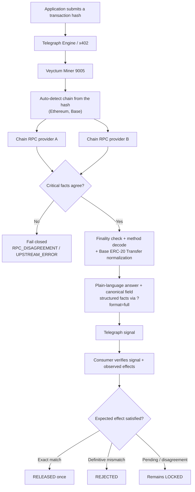

# Veyctum

[](https://github.com/mystiquemide/veyctum/actions/workflows/ci.yml)

**Veyctum is an effect oracle for autonomous actions: a Telegraph `ONCHAIN_TX_LOOKUP` Miner that turns an EVM transaction hash into verified facts and tells a consumer whether the expected payment effect actually happened.**

> **Transaction succeeded. Payment did not.**
>
> A successful EVM receipt is not proof that the effect a caller expected happened.

Veyctum takes a transaction hash, auto-detects which chain it lives on, and returns a direct natural-language answer plus inspectable evidence. For Base USDC it normalizes the actual token-transfer effect, so a consumer can separate execution success from payment fulfillment and act on the observed state change instead of trusting `receipt.status == 1`.

**Live Miner:** https://veyctum.splitpot.xyz
**Telegraph Miner ID:** `9005`
**Intent:** `ONCHAIN_TX_LOOKUP`
**Chains:** Ethereum (`1`) and Base (`8453`), auto-detected from the transaction hash
**Telegraph registration:** Base Sepolia, registration ID `213`

## The competitive edge

Most transaction tools answer **what the chain accepted**. Veyctum answers **whether the action's expected economic effect is proven**.

That distinction matters for agents, escrow, marketplaces, and any automated workflow that receives a transaction hash and must decide whether to release value. A receipt-only integration can release after a successful approval, wrong-recipient transfer, wrong amount, or unrelated contract call. Veyctum provides the missing verification boundary:

- **Observed facts, not caller assertions:** two RPC providers agree on the transaction, receipt, logs, chain, and finality before a result is definitive.
- **Semantic effects, not just execution status:** allowlisted token logs are normalized into sender, recipient, token, and exact raw amount.
- **Decision-ready output:** the reference consumer compares those facts with a frozen expectation and transitions `LOCKED -> RELEASED` only on an exact match.
- **Failure is useful intelligence:** successful-but-wrong transactions become explicit `REJECTED` outcomes instead of false positives.

The result is a reusable effect oracle: the Miner reports what happened, while each consumer keeps ownership of its own business rule and protected action.

## Why Veyctum exists

Autonomous systems frequently receive a transaction hash as proof that something happened on-chain. The obvious check is the receipt, but `status == 1` only proves the EVM execution did not revert.

It does not tell you what the transaction actually did: which method it called, which contract it touched, who sent it, how much moved, or whether the specific token transfer a consumer expected occurred. A successful approval, a wrong-recipient transfer, a wrong-amount transfer, or an unrelated call can all look successful at the receipt level while failing the outcome a system expected.

Veyctum closes that gap. It reports the observed facts of the transaction, and for Base USDC it normalizes the real transfer effect so a consumer can tell execution success apart from payment success.

## The mechanism



The Miner reports observed facts. The consumer owns the expected effect and the protected action, which keeps the intelligence reusable instead of baking one application's business rule into the Miner.

## Response shape

By default `/lookup` returns an answer-first, natural-language body:

```bash
curl 'https://veyctum.splitpot.xyz/lookup?tx_hash=0xb376975e90801e36a34432c960825a0c12a56d589a77a95aa552a7a3618678ee'
```

```json
{"answer":"Ethereum transaction 0xb376... was confirmed and succeeded. It called the bridgeERC20To method (selector 0x540abf73) on contract 0x99c9..., sent from 0x2ce9... with 0 ETH in native value. This was a contract call. It was included in block 25700000. The sender 0x2ce9... and recipient 0x99c9... are different addresses."}
```

`chain` is an optional hint; the chain is auto-detected from the hash regardless. For the full structured result, add `?format=full`:

```bash
curl 'https://veyctum.splitpot.xyz/lookup?tx_hash=0x...&format=full'
```

The structured body contains:

```text
schema_version
chain                detected chain name
chain_id
tx_hash
state
status
summary              the natural-language answer
method               { selector, name, signature, kind }
from
to
native_symbol
native_value
sender_is_recipient
canonical            chain|tx_hash|status|block_number|from|to|value_wei
finality
effects[]            normalized Base ERC-20 transfer effects
evidence
```

Full mode also includes the same natural-language response as `answer`. Telegraph
requests used by a consumer must pass `format=full` so the published signal
retains the normalized `effects` array needed for independent verification.

Key states:

- `OK` — supported finalized Base ERC-20 transfer effects were found.
- `NO_SUPPORTED_TRANSFER` — execution succeeded with no supported transfer effect. The `answer` and structured facts still describe the transaction.
- `PENDING` — the transaction is not yet definitive.
- `REVERTED` — EVM execution reverted.
- `RPC_DISAGREEMENT` / `UPSTREAM_ERROR` — providers disagree or a provider failed, so Veyctum fails closed rather than guessing.
- `NOT_FOUND`, `AMBIGUOUS`, `UNSUPPORTED`, `INVALID_INPUT` — explicit non-success states rather than fabricated certainty.

The chain registry also carries Arbitrum, Optimism, and Polygon; they can be enabled by configuration once needed. Ethereum and Base are enabled by default.

### Health

```text
GET /          judge quickstart and endpoint map
GET /health    process liveness
GET /ready      live per-chain reachability probe (chain id + head per chain)
```

### Canonical scoring compatibility

`ONCHAIN_TX_LOOKUP` is deterministic, so Veyctum also emits a compact `canonical` field built from the independently verified transaction facts:

```text
chain|tx_hash|status|block_number|from|to|value_wei
```

For the shared Base fixture, Veyctum's success-path canonical value is asserted by both unit and live integration tests to match the incumbent format exactly.

Recorded test state: **85 hermetic + 6 live integration tests passing**.

## Real proof, not a mock

The Telegraph Hackathon rules ask for evidence that the quality flywheel works in real conditions, not a polished demo. Veyctum's core claims are backed by real paid Telegraph requests, real signals, real transactions, and real x402 settlement.

| Proof | Result |
|---|---|
| Miner registration | Current on-chain registration `213` for Miner `9005`, active on Base Sepolia; legacy registration `104` remains recorded on-chain |
| Stable endpoint | `https://veyctum.splitpot.xyz` |
| Multi-chain answer | Ethereum transaction method and contract decoded and answered; covered by live integration tests |
| Canonical compatibility | Success-path canonical output matches the shared Base fixture exactly |
| Positive paid request | Real Base USDC transfer served by Veyctum in `1663 ms` |
| Positive signal | `0x8b782fecb8b5f92e5e5c4307ede66b2a3b462bfbac6014ca9e289281ffb4ef50` |
| Current-registration paid signal | `0xe39910a3033965102effcac686b5f25e18e3a5121b5e6e5fe7c26d6b2cee4e69` (`$0.01`, HTTP 200, 1444 ms) |
| Positive consumer outcome | Protected action changed from `LOCKED` to `RELEASED` exactly once |
| Negative paid request | Successful approval-only Base transaction served in `1236 ms` |
| Negative signal | `0x9ea3e072c53bf1904478b2388ae345991595e848924a580c670a92a9db5a87a0` |
| Negative consumer outcome | `REJECTED` with `NO_EFFECT`; duplicate verification could not flip it |

The positive fixture is a real Base USDC transfer:

`0x373982c25ba2c56c52c30a6db4ea14f9af267d6152f09f14f0b9b43e842e16a7`

The negative fixture is a real successful USDC approval transaction with no transfer effect:

`0x5c8ea6c032bbba661648924da38a8ecf67bafcf92a8cc81ad58af000f7620994`

The reproducible artifacts are indexed in [`evidence/`](./evidence/).

## Why this fits Telegraph

Telegraph's Miner track rewards verified intelligence that can be ranked and consumed by downstream applications. Veyctum is built around that loop:

1. **Request** — an application asks about a transaction.
2. **Infer** — Veyctum detects the chain, agrees the facts across two providers, decodes the method, and normalizes any Base transfer effect.
3. **Validate** — Telegraph evaluates the answer against ground truth.
4. **Publish** — the result is preserved as a Telegraph signal.
5. **Act** — a consumer independently verifies the signal before releasing or rejecting a protected action.
6. **Settle** — paid requests use Telegraph's x402 settlement path.

## Consumer proof gate

The repository includes a small reference consumer showing how an autonomous action can use Veyctum safely for Base USDC payments.

A protected action starts with a frozen expected effect:

```text
chain ID + token + sender + recipient + exact raw amount
```

Verification accepts a transaction hash and a real Telegraph signal hash. The server then:

1. independently fetches the transaction through Veyctum's two-provider path,
2. resolves the Telegraph signal,
3. verifies the signal's recorded effects equal the independently observed effects,
4. compares those facts with the frozen expectation,
5. performs one atomic state transition.

The Telegraph request that creates the signal must use the full response mode:

```json
{"method":"GET","endpoint":"/lookup","payload":{"chain":"base","format":"full","tx_hash":"0x..."}}
```

The reference consumer routes are protected with `x-consumer-api-key` when
`CONSUMER_AUTH_REQUIRED=true`. Set `CONSUMER_API_KEY` to a long random value in
the deployment environment. The public Miner lookup endpoint remains unauthenticated.

```text
LOCKED -> RELEASED   only on an exact verified match
LOCKED -> REJECTED   on a definitive semantic mismatch
LOCKED -> LOCKED     when evidence is not yet definitive
```

A caller cannot supply a fabricated lookup result to force a release, and a rejected or released action cannot be flipped by replaying verification.

### Judge replay

The complete positive and negative proof can be replayed against a local or deployed instance with the checked-in script below. It uses the real finalized fixtures and Telegraph signal hashes recorded in `evidence/`, so the result is not a mock:

```bash
CONSUMER_API_KEY='your-configured-key' \\
BASE_URL='https://veyctum.splitpot.xyz' \\
./scripts/replay_consumer_proof.sh
```

The script creates one frozen action, verifies the real transfer signal, and prints `RELEASED`. It then creates a second action for the approval-only transaction and prints `REJECTED` with `NO_EFFECT`. Consumer routes intentionally require the API key; use the local setup below when a public deployment key is not available.

## Reliability and safety

- For each chain, two independent RPC providers must agree on critical transaction facts, and both must report that chain's expected chain ID.
- The chain a transaction lives on is detected from the hash, not trusted from the request.
- Token identity is the allowlisted contract address, not ticker metadata.
- Only finalized supported transfer effects are treated as definitive.
- Method decoding uses a local signature set first, with an optional bounded 4byte.directory fallback, and always returns the raw selector.
- Unknown request fields are rejected.
- Public lookup traffic is rate-limited.
- Authorization and payment headers are redacted from logs.
- Reference consumer routes require `x-consumer-api-key` when
  `CONSUMER_AUTH_REQUIRED=true`; they are separate from the public Miner API.
- Consumer state transitions and audit attempts are persisted atomically in SQLite.
- Release requires a Telegraph signal and an independent effect cross-check.
- Secrets are loaded from environment variables and `.env` is ignored.

## Run locally

Requirements: Node.js 24+

```bash
git clone https://github.com/mystiquemide/veyctum.git
cd veyctum
npm ci
cp .env.example .env
# Set CONSUMER_API_KEY in .env before using /consumer/* routes.
npm run build
npm start
```

Development mode:

```bash
npm run dev
```

## Verification

```bash
npm run typecheck
npm test
npm run test:integration
npm run build
```

The hermetic suite does not require network access. Integration tests exercise live RPC behavior separately.

## Telegraph registration artifact

[`veyctum.yaml`](./veyctum.yaml) is the current Miner manifest. It declares multi-chain auto-detection, answer-first scoring output, and explicit full mode for effect verification. Registration `213` committed the current hosted bytes for Miner `9005`. Telegraph discovery may temporarily continue to show the older registration record while its node-side registry rehydrates.

Hosted manifest: https://veyctum.splitpot.xyz/veyctum.yaml

Current registration transaction:

[Base Sepolia transaction `0xfb1a5f...afdbd`](https://sepolia.basescan.org/tx/0xfb1a5f22259d6096f664a03048b53b1c5a8e27a2a1e7e28cdf1a3a02680afdbd)

Current manifest SHA-256: `3191ebf32c287925d197d56214450106aa610738223d45cc210f206da64484c8`

Legacy registration transaction:

[Base Sepolia transaction `0xd94ac235...7a95`](https://sepolia.basescan.org/tx/0xd94ac2357a6c7c1ba439837fb1c57a0b5a959a9f01405602e2d30e87b65c7a95)

## Repository map

```text
src/                 Miner API, chain auto-detection, two-provider RPC agreement,
                     method decode, canonical output, effect normalization, consumer gate
scripts/             Reproducible Telegraph/x402 probe utilities
test/                Hermetic and live integration tests
evidence/            Registration, paid-request, signal, settlement, and end-to-end proof
veyctum.yaml         Telegraph Miner registration manifest
.github/workflows/   CI
```

## Evidence

Start with [`evidence/README.md`](./evidence/README.md) for the shortest judge-oriented path through the proof artifacts.

## License

MIT
